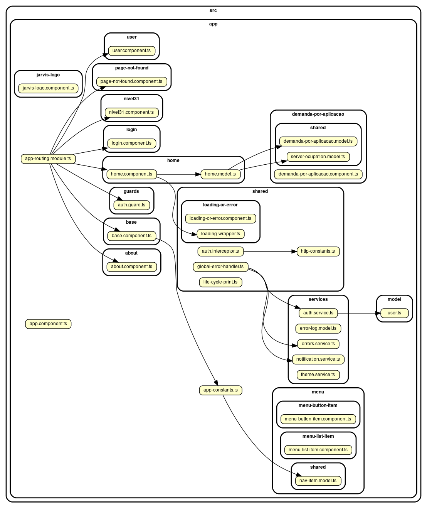

Gerar gráfico das dependências internas

$ sudo npm install --global dependency-cruiser
$ sudo dnf install graphviz
$ cd ./jarvis/frontend/ngapp
$ dependency-cruise -T dot -x '(node_modules|app.module.ts)' ./src/app/  | dot -T png > dependency-graph.png

Referências:
https://github.com/sverweij/dependency-cruiser
https://github.com/sverweij/dependency-cruiser/blob/develop/doc/real-world-samples.md
