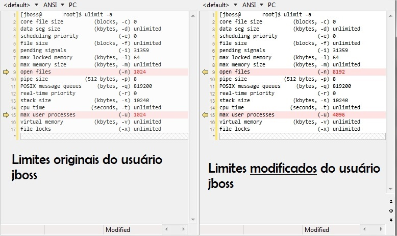

O JBoss EAP (Application Server) vinha apresentando problemas estranhos na subida. Quando um dos nós tentava subir alguns erros surgiam, geralmente ocorrendo: `Caused by: java.lang.OutOfMemoryError: unable to create new native thread`. Embora pareça um clássico problema de memória da JVM, o real problema é que o usuário que executava o JBoss tinha atingido os limites de recursos do sistema operacional disponibilizados para ele.

<!--more-->

Solução: modificar os limites do usuário que executa o JBoss.

O ambiente em questão contava com uma máquina virtual com 8 cores, 8 GB de RAM e 4 GB de swap, rodando: 4 Servidores JBoss, 1 Process Controller e 1 Host Controller.

## Solução

> 📋 Para esse passo a passo vamos supor que o usuário que executa o JBoss é: jboss

No terminal, logado como _jboss_, executar: `ulimit -a`

No caso, pelo visto, **open files** e/ou **max user processes** com os valores correntes não estão sendo suficientes. Ver imagem abaixo, lado esquerdo:



Que valores colocar? Para isso precisamos ter uma ideia de quantos arquivos abertos e threads estão para o usuário _jboss_, executando:

**Arquivos abertos:**

```shell
lsof | grep ' jboss ' | awk '{print $NF}' | sort | wc -l
# ou talvez seja melhor
lsof -u jboss | wc -l
```

**Threads (depois do enter digite o nome do usuário):**

```shell
ps -eLf | awk 'BEGIN { printf "User: "; getline user < "/dev/tty" } { if ( $1 == user ) userthreads+=1 } END { print "Thread count: "userthreads }'
```

Com base nos resultados obtidos devemos atualizar os limites de **open files** e **max user processes** para o usuário _jboss._

### Executar com root

- **open files**
Adicionar as linhas ao arquivo `/etc/security/limits.conf`:

```text
_jboss_ soft nofile 8192
_jboss_ hard nofile 12288
```

- **max user processes**
Deveria ser no mesmo arquivo, em várias outras distribuições Linux é, mas no caso do RHEL 6 (Red Hat Enterprise Linux) a mudança deve ser feita no arquivo `/etc/security/limits.d/90-nproc.conf` \[ref 1\] e no RHEL 7 em `/etc/security/limits.d/20-nproc.conf`:

Adicionar as linhas:

```text
_jboss_ soft nproc 4096
_jboss_ hard nproc 8192
```

Ver imagem acima, lado direito.

## Referências

- \[ref 1\] _"By default, the rules are read from the/etc/security/limits.conf file. For a complete description of the format of these rules, see the limits.conf(5) manual page. Additionally, you can create individual configuration files in the /etc/security/limits.d directory specifically for certain applications or services. By default, the pam_limits module is included in a number of files in the/etc/pam.d/ directory. **A default limit of user processes is defined in the /etc/security/limits.d/90-nproc.conf file to prevent malicious denial of service attacks, such as fork bombs.** To change the default limit of user processes to 50, change the value in the /etc/security/limits.d/90-nproc.conf"_

- [https://access.redhat.com/solutions/108233](https://access.redhat.com/solutions/108233)

- [https://access.redhat.com/solutions/453163](https://access.redhat.com/solutions/453163)

- [https://access.redhat.com/solutions/406663](https://access.redhat.com/solutions/406663)

- [https://cloudbees.zendesk.com/hc/en-us/articles/204231510-Memory-problem-unable-to-create-new-native-thread-](https://cloudbees.zendesk.com/hc/en-us/articles/204231510-Memory-problem-unable-to-create-new-native-thread-)
