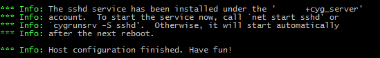

Instalar o Cygwin SSH Server como serviço no Windows.

<!--more-->

## Instalando

Instalar os pacotes abaixo no Cygwin:
_Dica: executar o próprio instalador do Cygwin para instalar os pacotes._

- openssh
- openssl
- cygrunsrv

Após a instalação dos pacotes acima, no terminal do Cygwin, executar:

```shell
ssh-host-config -y
```

O assistente vai criar o usuário `cyg_server` para rodar o serviço SSH e será necessário definir uma senha.

A mensagem abaixo deve ser exibida após a finalização com sucesso:



Nesse ponto o serviço SSH está instalado.

## Iniciando o serviço SSH

```shell
cygrunsrv -S sshd
```

## Parando o serviço SSH

```shell
cygrunsrv -E sshd
```

## Outros

- O serviço criado pode ser visualizado no `services.msc` com o nome `CYGWIN sshd`
- Para iniciar o serviço SSH com outro usuário, utilizar o parâmetro `-u` no comando `ssh-host-config`
