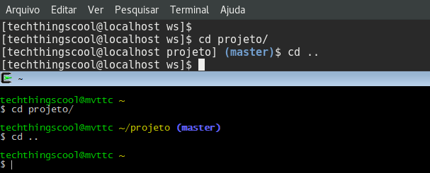

Os passos abaixo descrevem como exibir a branch do git no prompt de comando.

<!--more-->

## Fedora/RHEL/Cygwin

```shell
cd ~
wget https://raw.githubusercontent.com/git/git/8976500cbbb13270398d3b3e07a17b8cc7bff43f/contrib/completion/git-prompt.sh
mv git-prompt.sh .git-prompt.sh
chmod +x .git-prompt.sh
```

## Editar .bashrc adicionando as linhas

```shell
#Mostrando o branch do git no prompt
source ~/.git-prompt.sh
```

Se Fedora/RHEL, adicionar

```shell
export PS1='\[\e[1;36m\][\u@\h \W]\[\033[01;34m\]$(__git_ps1)\[\e[0m\]\$ '
```

Se Cygwin, adicionar

```shell
export PS1='\[\e]0;\w\a\]\n\[\e[32m\]\u@\h \[\e[33m\]\w\[\033[01;34m\]$(__git_ps1) \[\e[0m\]\n$ '
```

Salvar o arquivo .bashrc

## Efetivar a mudança do .bashrc

```shell
source .bashrc
```

A partir daqui ao entrar em um repositório git o branch será exibido no prompt.



[Mirror para o git-prompt.sh](https://drive.google.com/open?id=0B80EagoWEV2xa3dQRllrOTQxOFE)
