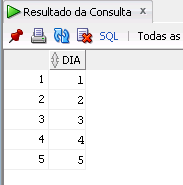
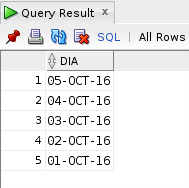
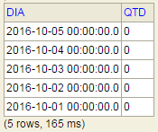

A necessidade é fazer uma consulta que tenha como base um conjunto sequencial de outra informação. Como exemplo, fazer uma segunda consulta com base em todos dias dentro de duas datas.

<!--more-->

Para isso, inicialmente, é necessário saber como fazer uma consulta que retorne todos os valores de um range. Agora vamos ao que interessa:

## Retorna os números inteiros entre 1 e 5

```sql
-- Retorna os números inteiros entre 1 e 5
WITH T(DIA) AS (
    SELECT 1 FROM DUAL
    UNION ALL
    SELECT DIA+1 FROM T WHERE DIA<5
)
SELECT DIA
FROM T
ORDER BY DIA ASC
;
```



## Retorna a datas (dia a dia) entre '01/10/2016' e '05/10/2016'

```sql
-- Retorna a datas (dia a dia) entre '01/10/2016' e '05/10/2016'
WITH T(DIA) AS (
    SELECT TO_DATE('01/10/2016' , 'DD/MM/YYYY') FROM DUAL
    UNION ALL
    SELECT CAST(DIA AS DATE)+1
    FROM T WHERE DIA<TO_DATE('05/10/2016' , 'DD/MM/YYYY')
)
SELECT DIA
FROM T
ORDER BY DIA DESC
;
```



## Retorna a quantidade de acessos por dia entre '01/10/2016' e '05/10/2016'

```sql
-- Retorna a quantidade de acessos por dia entre '01/10/2016' e '05/10/2016'
WITH T(DIA) AS (
    SELECT TO_DATE('01/10/2016' , 'DD/MM/YYYY') FROM DUAL
    UNION ALL
    SELECT CAST(DIA AS DATE)+1 FROM T WHERE DIA<TO_DATE('05/10/2016' , 'DD/MM/YYYY')
)
SELECT DIA
,
(
    SELECT COUNT(*)
    FROM users u
    WHERE
    CAST(DIA AS DATE) = CAST(u.data\_ultimo\_login AS DATE)
) AS QTD
FROM T
ORDER BY DIA DESC
;
```



Testes realizados no H2 e Oracle.

Fim!
