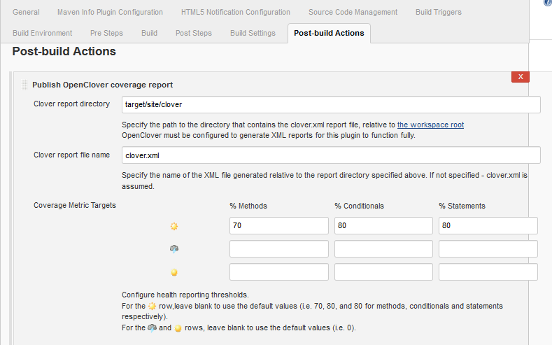
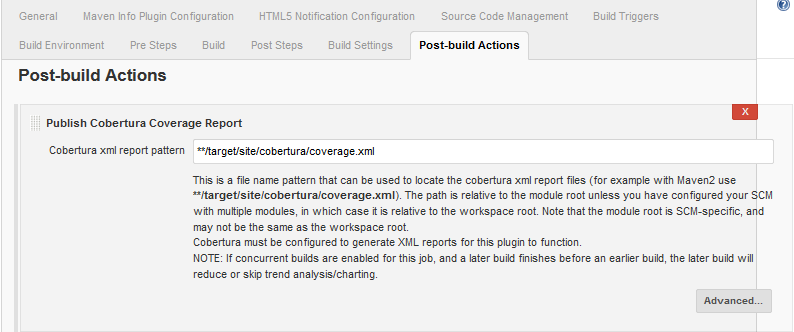
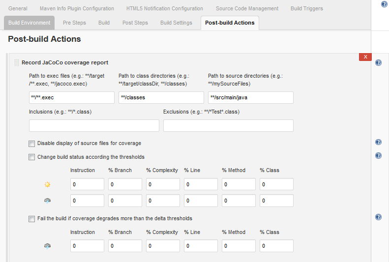

Configuração para Code Coverage usando Maven, Jenkins e um dos seguintes plugins para gerar a cobertura de código: OpenClover, Cobertura e JaCoCo.

<!--more-->

## OpenClover 

### Maven - pom.xml

```xml
<plugin>
    <groupId>org.openclover</groupId>
    <artifactId>clover-maven-plugin</artifactId>
    <version>4.2.0</version>
    <configuration>
        <jdk>1.8</jdk>
        <instrumentLambda>block</instrumentLambda>
        <showInnerFunctions>true</showInnerFunctions>
        <showLambdaFunctions>true</showLambdaFunctions>
        <includesTestSourceRoots>true</includesTestSourceRoots>
        <setTestFailureIgnore>true</setTestFailureIgnore>
        <generateHistorical>true</generateHistorical>
        <historyDir>${user.home}/.clover-history/${project.groupId}-${project.artifactId}</historyDir>
    </configuration>
</plugin>
```

#### Executar

```shell
mvn clean clover:setup package clover:aggregate clover:save-history clover:clover
```

Artefatos gerados

- target/clover
- target/site/clover/index.html

### Jenkins

Plugin

[https://wiki.jenkins.io/display/JENKINS/Clover+Plugin](https://wiki.jenkins.io/display/JENKINS/Clover+Plugin)

Configuração

- Goals do maven conforme acima
- No `Post-build Actions` adicionar `Publish OpenClover coverage report`



Observação:

Para acessar o relatório do Clover disponibilizado por dentro do Jenkins é necessário configurar o _Content Security Policy_. Para isso executar no Script Console do Jenkins:

```groovy
System.clearProperty("hudson.model.DirectoryBrowserSupport.CSP");

System.setProperty("hudson.model.DirectoryBrowserSupport.CSP", "default-src 'self'; script-src * 'unsafe-inline'; img-src * 'self' data:; style-src * 'unsafe-inline'; font-src *");

println(System.getProperty("hudson.model.DirectoryBrowserSupport.CSP"))
```

Se reiniciar o Jenkins as configurações acima são perdidas. Para deixar persistente é necessário configurar na inicialização. Mais detalhes abaixo:

- [https://wiki.jenkins.io/display/JENKINS/Configuring+Content+Security+Policy](https://wiki.jenkins.io/display/JENKINS/Configuring+Content+Security+Policy)
- [https://kb.froglogic.com/display/KB/Content+Security+Policy+%28CSP%29+for+Web+Report](https://kb.froglogic.com/display/KB/Content+Security+Policy+%28CSP%29+for+Web+Report)

* * *

## Cobertura

### Maven - pom.xml

```xml
<plugin>
    <groupId>org.codehaus.mojo</groupId>
    <artifactId>cobertura-maven-plugin</artifactId>
    <version>2.7</version>
    <configuration>
        <formats>
            <format>html</format>
            <format>xml</format>
        </formats>
        <instrumentation>
            <excludes> <!-- opcional -->
                <exclude>**/*_.class</exclude>
            </excludes>
        </instrumentation>
    </configuration>
    <dependencies>
        <dependency> <!-- se houver problema com ASM -->
            <groupId>org.ow2.asm</groupId>
            <artifactId>asm</artifactId>
            <version>6.0</version>
          </dependency>
    </dependencies>
</plugin>
```

#### Executar

```shell
mvn clean cobertura:cobertura
```

Artefatos gerados

- target/cobertura/
- target/site/cobertura/index.html

### Jenkins

Plugin

[https://wiki.jenkins.io/display/JENKINS/Cobertura+Plugin](https://wiki.jenkins.io/display/JENKINS/Cobertura+Plugin)

Configuração

- Goals do maven conforme acima
- No `Post-build Actions` adicionar `Publish Cobertura Coverage Report`



* * *

## JaCoCo

### Maven - pom.xml

```xml
<plugin>
    <groupId>org.jacoco</groupId>
    <artifactId>jacoco-maven-plugin</artifactId>
    <version>0.7.9</version>
    <executions>
        <execution>
            <goals>
                <goal>prepare-agent</goal>
            </goals>
        </execution>
        <execution>
            <id>report</id>
            <phase>prepare-package</phase>
            <goals>
                <goal>report</goal>
            </goals>
        </execution>
    </executions>
</plugin>
```

#### Executar

```shell
mvn clean package
```

Artefatos gerados

- target/jacoco.exec
- target/site/jacoco/index.html
- target/site/jacoco/jacoco.csv
- target/site/jacoco/jacoco.xml

### Jenkins

Plugin

[https://wiki.jenkins.io/display/JENKINS/JaCoCo+Plugin](https://wiki.jenkins.io/display/JENKINS/JaCoCo+Plugin)

Configuração

- Goals do maven conforme acima
- No 'Post-build Actions' adicionar 'Record JaCoCo coverage report'



Fim
