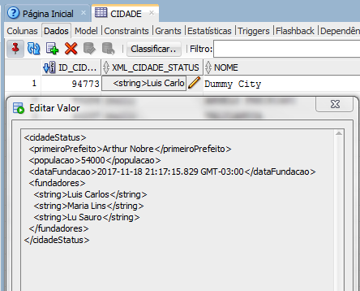
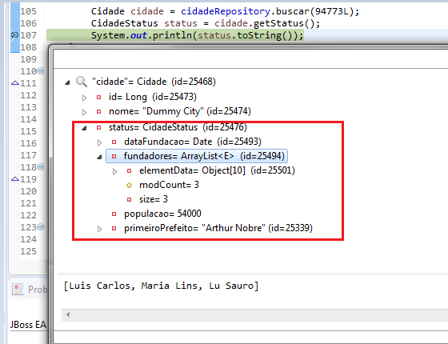

A ideia é persistir uma entidade que possua um relacionamento qualquer com um objeto e esse objeto será persistido no banco de dados como XML (não é String!), mas especificamente o tipo XMLType.

<!--more-->

Tanto a persistência quanto a recuperação desse objeto é totalmente transparente para o desenvolvedor com relação ao XML.

No exemplo existe a entidade `Cidade` que possui um atributo do tipo `CidadeStatus` (CidadeStatus não é uma entidade!) que é persistido no banco de dados como XML. A serialização e desrealização para XML será feita pelo XStream.

## Etapas

- Criar coluna no Oracle
- Adicionar _modules_ ao JBoss (módulos do Oracle para trabalhar com `XMLType`)
- Configurar o `jboss-deployment-structure.xml`
- Adicionar dependências ao pom.xml (maven!)
- Criar um org.hibernate.usertype.UserType
- Testar a gravação e verificar no banco de dados
- Testar a recuperação

Se qualquer versão aqui apresentada diferir da sua, ajuste as versões.

## Criar coluna no Oracle

```sql
ALTER TABLE cidade add (XML_CIDADE_STATUS XMLType);
```

## Adicionar _modules_ ao JBoss

São necessários:

- `ojdbc6.jar` - driver do banco de dados;
- `xdb6.jar` - para suporte a XML, pode ser obtido na mesma página que o `ojdbc6.jar`;
- `xmlparserv2.jar` - para suporte a XML, recomendo obter a partir do diretório de instalação do Oracle;

Os arquivos acima já configurados como módulos estão aqui: [modules.7z](https://drive.google.com/open?id=1ZubEVuZN3U0VVIhRCOerkOdFsiW2a0Lu). O conteúdo deve ser extraído ficando a seguinte estrutura: `$JBOSS_HOME\modules\com\oracle`


## jboss-deployment-structure.xml

_Com os módulos que devem ser carregados. Se o projeto tiver sub-deployment os módulos devem ser informados nos mesmos._

```xml
<jboss-deployment-structure>
    <deployment>
        <dependencies>
            <module name="com.oracle.xdb6" slot="main" />
            <module name="com.oracle" slot="main" />
        </dependencies>
    </deployment>
</jboss-deployment-structure>
```

## pom.xml

Com as dependências necessárias.

```xml
<dependency>
    <groupId>com.thoughtworks.xstream</groupId>
    <artifactId>xstream</artifactId>
    <version>1.3.1</version>
</dependency>
<dependency>
    <groupId>com.thoughtworks.xstream</groupId>
    <artifactId>xstream-hibernate</artifactId>
    <version>1.4.10</version>
</dependency>
<dependency>
    <groupId>com.oracle</groupId>
    <artifactId>ojdbc6</artifactId>
    <version>11.2.0</version>
    <scope>provided</scope>
</dependency>
<dependency>
    <groupId>com.oracle</groupId>
    <artifactId>xdb6</artifactId>
    <version>11.2.0.4</version>
    <scope>provided</scope>
</dependency>
```

## Entidade Cidade.java

```java
import java.io.Serializable;

import javax.persistence.Column;
import javax.persistence.Entity;
import javax.persistence.GeneratedValue;
import javax.persistence.GenerationType;
import javax.persistence.Id;
import javax.persistence.SequenceGenerator;

import org.hibernate.annotations.Type;
import org.hibernate.annotations.TypeDef;
import org.hibernate.annotations.TypeDefs;

@Entity
@SequenceGenerator(name = "seq_cidade", sequenceName = "seq_cidade", allocationSize = 1)
@TypeDefs({
    @TypeDef(name = "CidadeStatus", typeClass = CidadeStatusUserType.class)
})
public class Cidade implements Serializable {

    @Id
    @GeneratedValue(strategy = GenerationType.SEQUENCE, generator = "seq_cidade")
    @Column(name = "ID_CIDADE")
    private Long id;

    @Column(length = 50, nullable = false, name = "NOME")
    private String nome;

    // Criar coluna: ALTER TABLE cidade add (XML_CIDADE_STATUS XMLType);
    @Column(name = "XML_CIDADE_STATUS")
    @Type(type = "CidadeStatus")
    private CidadeStatus status;

}
```

## CidadeStatus.java

Será gravado no banco de dados como XML.

```java
import java.io.Serializable;
import java.util.ArrayList;
import java.util.Date;
import java.util.List;

import com.thoughtworks.xstream.annotations.XStreamAlias;

@XStreamAlias("cidadeStatus")
public class CidadeStatus implements Serializable {

    private String primeiroPrefeito;

    private int populacao;

    private Date dataFundacao;

    private List<String> fundadores = new ArrayList<String>();

    public CidadeStatus() {

    }

    public CidadeStatus(String primeiroPrefeito, int populacao, Date dataFundacao) {
        super();
        this.primeiroPrefeito = primeiroPrefeito;
        this.populacao = populacao;
        this.dataFundacao = dataFundacao;
    }

    public void setFundadores(List<String> fundadores) {
        this.fundadores = fundadores;
    }

    @Override
    public String toString() {
        return "CidadeStatus [primeiroPrefeito=" + primeiroPrefeito + ", populacao=" + populacao + ", dataFundacao="
            + dataFundacao + ", fundadores=" + fundadores + "]";
    }

}
```

## CidadeStatusUserType.java

É por meio dessa classe que o Hibernate sabe salvar o CidadeStatus como XML e sabe recuperar o XML convertendo em CidadeStatus.

A serialização do XStream feita por essa classe já dá suporte a Proxy e aos tipos internos do Hibernate.

```java
public class CidadeStatusUserType implements UserType {

    private static final Logger log = LogManager.getLogger(CidadeStatusUserType.class);

    private static final XStream xstream;

    static {
        try {
            log.info("init static");
            xstream = new XStream() {
                protected MapperWrapper wrapMapper(final MapperWrapper next) {
                    return new HibernateMapper(next);
                }
            };

            // http://x-stream.github.io/faq.html#Serialization_Hibernate
            xstream.registerConverter(new HibernateProxyConverter());
            xstream.registerConverter(new HibernatePersistentCollectionConverter(xstream.getMapper()));
            xstream.registerConverter(new HibernatePersistentMapConverter(xstream.getMapper()));
            xstream.registerConverter(new HibernatePersistentSortedMapConverter(xstream.getMapper()));
            xstream.registerConverter(new HibernatePersistentSortedSetConverter(xstream.getMapper()));

            xstream.processAnnotations(CidadeStatus.class);
        } catch (Exception e){
            throw new RuntimeException("Cannot initialize XStream", e);
        }
    }

    @Override
    public int[] sqlTypes() {
        return new int[]{XMLType._SQL_TYPECODE};
    }

    @Override
    public Class returnedClass() {
        return CidadeStatus.class;
    }

    @Override
    public boolean equals(final Object x, final Object y) {
        return (x != null) && x.equals(y);
    }

    @Override
    public int hashCode(final Object x) {
        return (x != null) ? x.hashCode() : 0;
    }

    @Override
    public Object nullSafeGet(ResultSet resultSet, String[] names, Object owner) throws HibernateException, SQLException {
        XMLType xmlType = (XMLType) resultSet.getObject(names[0]);

        CidadeStatus cidadeStatus = null;
        if (xmlType != null) {
            cidadeStatus = (CidadeStatus) xstream.fromXML(xmlType.getInputStream());
        }

        return cidadeStatus;
    }

    @Override
    public void nullSafeSet(PreparedStatement statement, Object value, int index) throws HibernateException, SQLException {
        try {
            XMLType xmlType = null;
            if (value != null) {
                Connection connection = statement.getConnection().unwrap(OracleConnection.class);
                xmlType = new XMLType(connection, xstream.toXML(value));
            }
            statement.setObject(index, xmlType);
        } catch (Exception e) {
            throw new SQLException("Could not marshal Cidade", e);
        }
    }

    @Override
    public Object deepCopy(final Object value) {
        return value;
    }

    @Override
    public boolean isMutable() {
        return true;
    }

    @Override
    public Serializable disassemble(final Object value) {
        return (Serializable) value;
    }

    @Override
    public Object assemble(final Serializable cached, final Object owner) {
        return cached;
    }

    @Override
    public Object replace(final Object original, final Object target, final Object owner) {
        return original;
    }

}
```

## Testando a gravação e verificando no banco de dados

Persistindo.

```java
Cidade cidade = new Cidade();
cidade.setNome("Dummy City");

CidadeStatus cidadeStatus = new CidadeStatus("Arthur Nobre", 54000, new Date());
List<String> fundadores = new ArrayList<String>();
fundadores.add("Luis Carlos");
fundadores.add("Maria Lins");
fundadores.add("Lu Sauro");
cidadeStatus.setFundadores(fundadores);

cidade.setStatus(cidadeStatus);

entityManager.persist(cidade);
```

Verificando no banco de dados.



## Testando a recuperação



É isso!
