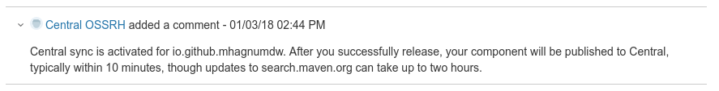

Abaixo os passos para realizar uma publicação no Maven Central.

<!--more-->

## Criar uma conta no Sonatype

[http://central.sonatype.org/pages/ossrh-guide.html#create-a-ticket-with-sonatype](http://central.sonatype.org/pages/ossrh-guide.html#create-a-ticket-with-sonatype)

## Gerar as chaves GPG

_Se já possui as chaves, utilize-a e desconsidere essa etapa._

```shell
# Criar a chave
gpg2 --gen-key
```

```shell
# Listar as chaves
gpg2 --list-keys
```

```shell
# Enviar as chaves para os servidores de chaves remotas
gpg2 --send-keys KEY
```

```shell
# Confirmar se a chave está disponível
gpg2 --recv-keys KEY

# ou especificando o servidor
gpg2 --keyserver hkp://pool.sks-keyservers.net --recv-keys KEY
```

> **É bem importante guardar a passphrase e fazer backup da pasta ~/.gnupg**

## pom.xml

O `pom.xml` abaixo já segue os requisitos mínimos para publicação no Maven Central. Tome como exemplo.

Observar que a versão é `-SNAPSHOT`. Mais a frente vamos gerar a release.

```xml
<project xmlns="http://maven.apache.org/POM/4.0.0" xmlns:xsi="http://www.w3.org/2001/XMLSchema-instance" xsi:schemaLocation="http://maven.apache.org/POM/4.0.0 http://maven.apache.org/xsd/maven-4.0.0.xsd">

    <parent>
        <groupId>org.sonatype.oss</groupId>
        <artifactId>oss-parent</artifactId>
        <version>7</version>
    </parent>

    <modelVersion>4.0.0</modelVersion>
    <groupId>io.github.mhagnumdw</groupId>
    <artifactId>bean-info-generator</artifactId>
    <version>0.1.1-SNAPSHOT</version>
    <name>Bean Info Generator</name>
    <description>Java - Generate static information about Java Beans</description>
    <url>https://github.com/mhagnumdw/bean-info-generator</url>

    <scm>
        <connection>scm:git:https://github.com/mhagnumdw/bean-info-generator.git</connection>
        <developerConnection>scm:git:https://github.com/mhagnumdw/bean-info-generator.git</developerConnection>
        <url>git@github.com/mhagnumdw/bean-info-generator.git</url>
        <tag>HEAD</tag>
    </scm>

    <issueManagement>
        <system>GitHub</system>
        <url>https://github.com/mhagnumdw/bean-info-generator/issues</url>
    </issueManagement>

    <distributionManagement>
        <snapshotRepository>
            <id>ossrh</id>
            <url>https://oss.sonatype.org/content/repositories/snapshots</url>
        </snapshotRepository>
        <repository>
            <id>ossrh</id>
            <url>https://oss.sonatype.org/service/local/staging/deploy/maven2</url>
        </repository>
    </distributionManagement>

    <properties>
        <project.build.sourceEncoding>UTF-8</project.build.sourceEncoding>
        <java.version>1.8</java.version>
        <maven.release.plugin>2.5.3</maven.release.plugin>
        <maven.compiler.plugin>3.6.0</maven.compiler.plugin>
        <maven.source.plugin>3.0.1</maven.source.plugin>
        <maven.javadoc.plugin>2.10.4</maven.javadoc.plugin>
        <cobertura.version>2.7</cobertura.version>
        <coveralls.version>3.1.0</coveralls.version>
    </properties>

    <dependencies>
        <!-- Dependências aqui -->
    </dependencies>

    <build>
        <plugins>
            <plugin>
                <groupId>org.apache.maven.plugins</groupId>
                <artifactId>maven-compiler-plugin</artifactId>
                <version>${maven.compiler.plugin}</version>
                <configuration>
                    <source>${java.version}</source>
                    <target>${java.version}</target>
                    <optimize>true</optimize>
                    <encoding>UTF-8</encoding>
                    <showWarnings>true</showWarnings>
                    <showDeprecation>true</showDeprecation>
                    <!-- Disable annotation processing for ourselves. -->
                    <compilerArgument>-proc:none</compilerArgument>
                </configuration>
                <inherited>true</inherited>
            </plugin>

            <plugin>
                <groupId>org.apache.maven.plugins</groupId>
                <artifactId>maven-release-plugin</artifactId>
                <version>${maven.release.plugin}</version>
                <configuration>
                    <goals>deploy</goals>
                    <tagNameFormat>v@{project.version}</tagNameFormat>
                    <pushChanges>true</pushChanges>
                    <scmCommentPrefix>[maven-release-plugin]</scmCommentPrefix>
                    <autoVersionSubmodules>true</autoVersionSubmodules>
                </configuration>
            </plugin>

            <plugin>
                <groupId>org.apache.maven.plugins</groupId>
                <artifactId>maven-source-plugin</artifactId>
                <version>${maven.source.plugin}</version>
                <executions>
                    <execution>
                        <id>attach-sources</id>
                        <goals>
                            <goal>jar</goal>
                        </goals>
                    </execution>
                </executions>
            </plugin>

            <plugin>
                <groupId>org.apache.maven.plugins</groupId>
                <artifactId>maven-javadoc-plugin</artifactId>
                <version>${maven.javadoc.plugin}</version>
                <configuration>
                    <additionalparam>-Xdoclint:none</additionalparam>
                </configuration>
                <executions>
                    <execution>
                        <id>attach-javadocs</id>
                        <goals>
                            <goal>jar</goal>
                        </goals>
                    </execution>
                </executions>
            </plugin>
        </plugins>
    </build>

</project>
```

## Alterar o settings.xml

Acrescentar o server

```xml
<server>
    <id>ossrh</id> <!-- mesmo nome definido no pom.xml -->
    <username>mhagnumdw</username>
    <password>sonatype-password</password>
</server>
```

Acrescentar o profile

```xml
<profile>
    <id>ossrh</id>
    <activation>
      <activeByDefault>true</activeByDefault>
    </activation>
    <properties>
      <gpg.executable>gpg2</gpg.executable>
      <gpg.keyname>KEY</gpg.keyname>
      <gpg.passphrase>FRASE-SECRETA</gpg.passphrase>
    </properties>
</profile>
```

## Gerar a release

```shell
mvn release:clean release:prepare
```

A linha de comando acima vai buildar, testar, assinar os artefatos gerados pelo maven com a chave gpg `(~/.gnupg)`, alterar o `pom.xml`, criar a tag, fazer commit e realizar um push.

> O push é automático porque está definido no `pom.xml` em `<pushChanges>true</pushChanges>`

```shell
mvn release:perform
```

A linha de comando acima vai fazer o checkout da tag, buildar e fazer o deploy dos artefatos gerados pelo maven e assinados com a chave GPG na etapa anterior. O deploy é feito para staging do sonatype, ainda não é para o maven central.

```shell
mvn release:clean
```

Para apagar arquivos temporários que o plugin de release do maven gera.

## Liberar release

1. Acessar e se logar em [https://oss.sonatype.org](https://oss.sonatype.org);
1. Selecionar `Staging repositories`;
1. Selecionar o repositório criado no deploy e clicar em `Close`;
1. Verificar a guia de atividades, que vai informar se está tudo ok ou se alguma etapa de validação falhou;
1. Se tudo ok é só clicar no botão `Release` e será iniciada a sincronização com o maven central (isso pode levar alguns minutos).

Aqui um vídeo demonstrando essa etapa: [https://www.youtube.com/watch?v=dXR4pJ_zS-0](https://www.youtube.com/watch?v=dXR4pJ_zS-0)

Após essa etapa o ticket aberto no JIRA do Sonatype será respondido. Ver imagem de exemplo abaixo:



## Alguns minutos ou horas depois...

A sincronização com o maven central deve ocorrer alguns minutos depois, mas para a lib aparecer na busca [https://search.maven.org](https://search.maven.org) pode levar umas 2 horas.

## Referências

- [http://central.sonatype.org/pages/ossrh-guide.html](http://central.sonatype.org/pages/ossrh-guide.html)
- [http://www.baeldung.com/maven-release-nexus](http://www.baeldung.com/maven-release-nexus)
- [http://central.sonatype.org/pages/apache-maven.html](http://central.sonatype.org/pages/apache-maven.html)
