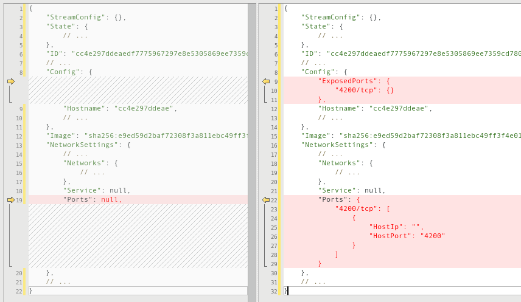
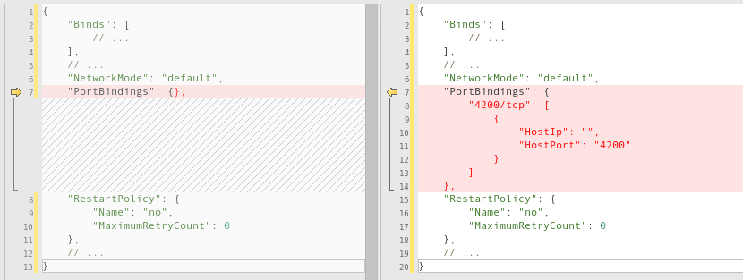

Expor portas de um container previamente criado.

<!--more-->

## Neste exemplo vamos querer expor a porta `4200`

### Passos iniciais

```bash
# Obter o ID do container
docker ps --all

# Parar o container
docker stop $ID

# Parar o serviço do docker
sudo systemctl stop docker

# visualizar a pasta do container
# deve existir uma pasta que começa com $ID
ls -la /var/lib/docker/containers/

# acessar a pasta do container
cd /var/lib/docker/containers/$FULL_ID

# fazer backup
cp -ra . /tmp/container-original/
```

### Editar o arquivo `config.v2.json`

> **DICA** 📋 Copie o conteúdo para algum editor que seja possível formatar. Isso ajuda na visualização.

 Abaixo o antes e o depois do arquivo:



### Editar o arquivo `hostconfig.json`

Abaixo o antes e o depois do arquivo:



### Passos finais

```bash
# Iniciar o serviço do docker
# DEVE-SE USAR O RESTART PARA QUE O DOCKER LIMPE O CACHE
sudo systemctl restart docker

# Iniciar o container previamente parado
docker start -ai $ID

# Visualizar se a porta está exposta e listening
docker ps --all
sudo netstat -tulnp | grep -i -P '4200'
```

## Detalhes do ambiente

- Fedora 28
- Docker client 1.13.1 / 18.x
- Docker server 1.13.1 / 18.x

## Referências

- Com a solução apresentada aqui e várias outas: <https://stackoverflow.com/questions/19335444/how-do-i-assign-a-port-mapping-to-an-existing-docker-container>
