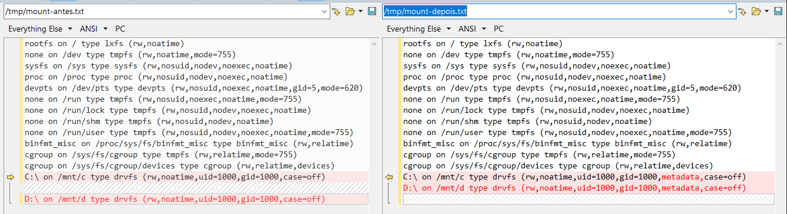

Alterar permissões com `chmod` não surte efeito no Windows WSL. Teste e solução.

<!--more-->

## Ambiente de teste

- Windows 10 Pro Versão 10.0.18363 Compilação 18363
- WSL 1
- Linux: Ubuntu 18.04.2 LTS (Bionic Beaver)

## Simulando o problema

```bash
cd /tmp/
echo "teste" > teste.txt
ls -la
# Observar as permissões do arquivo
```

Tentar mudar a permissão do arquivo

```bash
chmod 600 teste.txt
ls -la
```

Aqui provavelmente você verá que as permissões do arquivo não mudaram. _Se mudaram, acho que você não precisa continuar._

> **NOTA**: antes de irmos para a solução vamos guardar o output do comando: `mount -l > /tmp/mount-antes.txt`

## Solução

Dentro do WSL Linux, no caso um WSL Ubuntu, editar/criar o arquivo
`/etc/wsl.conf` com o conteúdo

```conf
[automount]
options = "metadata"
```

Fechar o WSL completamente:

- Sair de todas as instâncias do WSL (`exit` em todos os terminais)
- Abrir o power shell
  - Obter o nome da instância WSL que foi alterada: `wsl --list`
  - O output do comando pode ser algo parecido com:

    ```text
    Distribuições do Subsistema do Windows para Linux:
    Ubuntu (Padrão)
    ```

  - Desligar a instância pelo nome: `wsl -t Ubuntu`

## Verificando se tudo ok

- Abrir o WSL (no caso um WSL Ubuntu)
- Executar o chmod no arquivo e verificar se as permissões mudaram

Se mudaram tudo ok! ;)

> **NOTA**: vamos gerar um novo output do mount: `mount -l > /tmp/mount-depois.txt`. Você teve ter um diff parecido com o diff abaixo. **Observar o atributo `metadata` na diferença.**



## Referências

- <https://devblogs.microsoft.com/commandline/automatically-configuring-wsl/>
- <https://github.com/Microsoft/WSL/issues/81>
- <https://github.com/microsoft/WSL/issues/3181#issuecomment-394762108>
- <https://superuser.com/questions/1126721/rebooting-ubuntu-on-windows-without-rebooting-windows#1347725>
