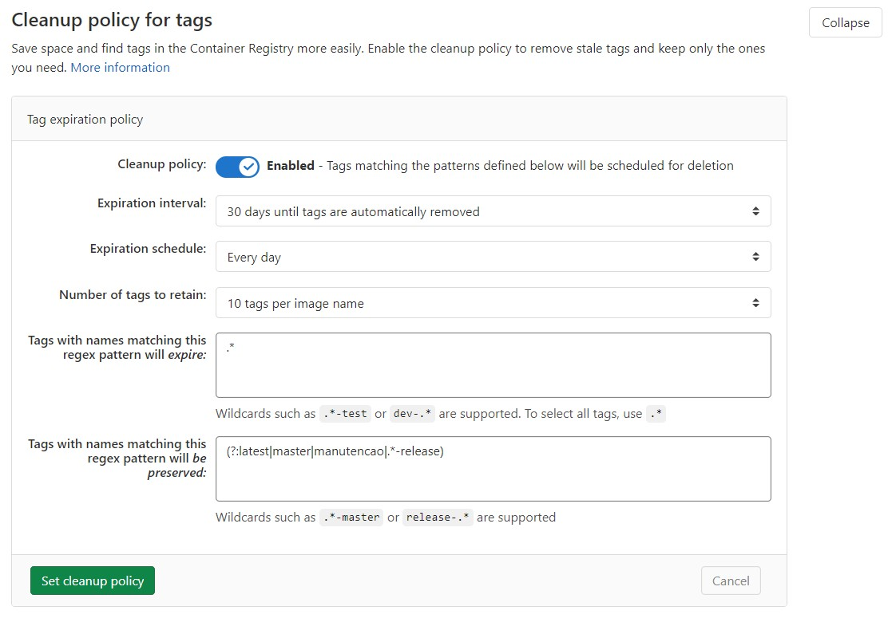

É comum um projeto acumular muitas imagens docker e também é comum o registry, que acaba abrigando imagens docker de diversos projetos, crescer mais ainda, consumindo muito espaço em disco. De forma bem simples e direta (embora não seja muito possível nesse caso), vamos ver como fazer essa limpeza.

<!--more-->

> 📋 Procedimentos realizados no GitLab 13.5.1
>
> 📋 Requer conhecimento de alguns conceitos de Docker.

## Locais que devem ser configurados

- No projeto (pela interface web)
- No registry do GitLab (por linha de comando)

## Limpeza no registry do projeto

O GitLab chama esse recurso de _Cleanup policy for tags_ e pode ser configurado pela interface web no menu `Settings > CI / CD > Cleanup policy for tags` do projeto.

Basta ativar e setar os parâmetros. Abaixo um exemplo real.



Explicando a imagem acima e seus valores

- **Expiration interval:** tags com mais de 30 dias poderão ser excluídas
- **Expiration schedule:** período que a rotina de limpeza é executada, no caso todo dia
- **Number of tags to retain:** sempre deve manter no mínimo 10 tags
- **Tags with names matching this regex pattern will expire:** tags que combinem com esse padrão (observe que é um _regex_) são elegíveis para exclusão, no caso todas
- **Tags with names matching this regex pattern will be preserved:** tags que combinem com esse padrão (observe que é um _regex_) **não devem ser excluídas**

> 📋 **ATENÇÃO**
>
> É de **suma importância** que você entenda a lógica acima, pois tags de imagens docker serão deletadas do registry. Para entender exatamente a lógica do GitLab, veja essa explicação passo-a-passo do fluxo que ele segue no item [How the cleanup policy works](https://docs.gitlab.com/ee/user/packages/container_registry/#how-the-cleanup-policy-works).

## Remoção de lixo do Registry (Garbage collection)

Após tags docker serem deletadas do registry, quer sejam pela ativação e configuração do _Cleanup policy for tags_ (explicado acima), quer sejam pela interface web no menu `Packages & Registries > Container Registry` do projeto, quer sejam usando o [skopeo](https://github.com/containers/skopeo), ou por qualquer outro meio, o registry continua mantendo camadas (_layers_) docker.

Por padrão o armazenamento do registry fica em `/var/opt/gitlab/gitlab-rails/shared/registry`.

Para ver o tamanho da pasta:

```bash
du -h -c -s /var/opt/gitlab/gitlab-rails/shared/registry
# ou mesmo um
df -h
```

### Remover tags não usadas (opção 1)

> 📋 **Spoiler** 👀
>
> A **opção 2** (mais abaixo) é mais completa, mas mais perigosa se você não souber o que está fazendo, então continue lendo com calma.

Tags não usadas são tags que foram desassociadas do manifesto. Exemplo: você publica a tag `latest` e suponha que ela assume o identificador `sha256:111111`, você publica a tag `latest` novamente e suponha que agora ela ganha identificador `sha256:222222`. A primeira versão não é mais acessível por meio da tag `latest`, mas ainda é acessível usando o seu identificador `image-name@sha256:111111`. Dessejamos então remover essa pseudo-tag `sha256:111111`.

```bash
# Executando a limpeza
sudo gitlab-ctl registry-garbage-collect
```

Saiba que o comando acima irá:

- parar o serviço do registry
- rodar o garbage collect e pode demorar um pouco
- iniciar serviço do registry

> 📋 **NOTA**
>
> O registry ficará indisponível para `pull` e `push`

### Remover manifestos não marcados e camadas não referenciadas (opção 2)

> 📋 Se preferir esta opção, não precisa executar a opção anterior.

O registry, seguindo o próprio fluxo do docker, mantém manifestos não marcados e camadas não referenciadas, mesmo que não sejam mais referenicadas.

```bash
# Executando a limpeza
sudo gitlab-ctl registry-garbage-collect -m
```

Apenas o parâmetro `-m` foi adicionado em relação ao comando da opção anteior. O registry também ficará inoperante durante a limpeza, assim como na opção anterior.

> 📋 **NOTA**
>
> **Nesta opção é que você verá uma redução significativa do uso de disco.**

### Executar a limpeza sem deixar o registry inativo

É um passo a passo simples que você pode ver [aqui](https://docs.gitlab.com/ce/administration/packages/container_registry.html#performing-garbage-collection-without-downtime).

### Agendar a limpeza do registry

Preferencialmente em um horário que o registry não seja usado (lembre-se de rotinas automáticas que precisem do registry). Basta agendar no _cron_, criando o arquivo `/etc/cron.d/registry-garbage-collect` com o conteúdo abaixo:

```bash
SHELL=/bin/sh
PATH=/usr/local/sbin:/usr/local/bin:/sbin:/bin:/usr/sbin:/usr/bin

# Run every Sunday at 04:05am
5 4 * * 0  root gitlab-ctl registry-garbage-collect -m
```

> 📋 **NOTA**
>
> Lembre-se que o registry ficará indisponível durante a limpeza, mas nada impede que, dado o que foi falado no item _Executar a limpeza sem deixar o registry inativo_, que você crie um script onde o registry só ficará indisponível para `push`, ainda permitindo que o `pull` de imagens seja realizado.

## Referências

- <https://docs.gitlab.com/ce/administration/packages/container_registry.html#container-registry-garbage-collection>
- <https://docs.gitlab.com/ce/administration/packages/container_registry.html>
- <https://docs.gitlab.com/ce/user/packages/container_registry/#how-the-cleanup-policy-works>
- O que aqui foi dito foi constatado na prática
