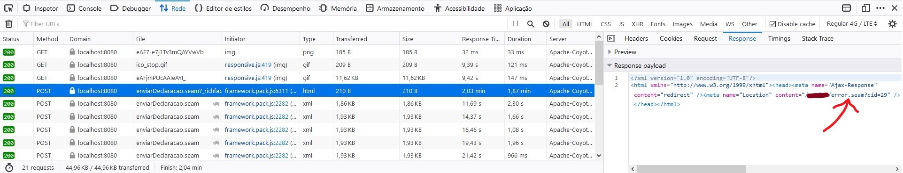

O componente de upload apresenta a mensagem _Transfer error occurred_ e no log o `arjuna` apresenta uma mensagem de WARN informando que o tempo da transação esgotou.

<!--more-->

## Ambiente

- JBoss EAP 6.4.20
- RichFaces 3.3.X
- JBoss Seam 2.2.X
- [arjuna](https://narayana.io/arjuna-core/index.html)

## Erro

Tela do componente `rich:fileUpload`:


No log do servidor há mensagens parecidas com essas:

```console
15:28:43,239 WARN  [com.arjuna.ats.arjuna] (Transaction Reaper) ARJUNA012117: TransactionReaper::check timeout for TX 0:ffffac1d2001:519735cd:5ff8a379:17d in state  RUN
15:28:43,241 WARN  [com.arjuna.ats.arjuna] (Transaction Reaper Worker 0) ARJUNA012095: Abort of action id 0:ffffac1d2001:519735cd:5ff8a379:17d invoked while multiple threads active within it.
15:28:43,241 WARN  [com.arjuna.ats.arjuna] (Transaction Reaper Worker 0) ARJUNA012108: CheckedAction::check - atomic action 0:ffffac1d2001:519735cd:5ff8a379:17d aborting with 1 threads active!
15:28:43,242 WARN  [com.arjuna.ats.arjuna] (Transaction Reaper Worker 0) ARJUNA012121: TransactionReaper::doCancellations worker Thread[Transaction Reaper Worker 0,5,main] successfully canceled TX 0:ffffac1d2001:519735cd:5ff8a379:17d
```

<br/>
Requests no developer tools. Retorna http `200`, mas pelo payload dá pra ver que redireciona para a tela de erro:



## Qual é o problema?

O upload demora mais que o tempo da transação. Mas o upload continua mesmo após o timeout da transação. Quando a aplicação vai usar o arquivo e precisa da transação, temos uma exceção: `Caused by: javax.resource.ResourceException: IJ000459: Transaction is not active: tx=TransactionImple < ac, BasicAction: 0:ffffac1d2001:519735cd:5ff8a379:17d status: ActionStatus.ABORTED`.

## Solução

O upload do arquivo é tratado pela classe `org.richfaces.component.FileUploadPhaselistener`. O contexto do `Seam` e demarcação de transação são feitos pela classe `org.jboss.seam.jsf.SeamPhaseListener`.

É preciso definir o tempo da transação antes do `FileUploadPhaselistener` e `SeamPhaseListener`. Abaixo um exemplo de filtro (`javax.servlet.Filter`) que muda o tempo da transação para requests com `Content-Type` do tipo `multipart/form-data`.

### Filtro `ChangeTransactionTimeoutForContentTypeMultipartFormData.java`

```java
import java.io.IOException;

import javax.naming.InitialContext;
import javax.naming.NameNotFoundException;
import javax.naming.NamingException;
import javax.servlet.Filter;
import javax.servlet.FilterChain;
import javax.servlet.FilterConfig;
import javax.servlet.ServletException;
import javax.servlet.ServletRequest;
import javax.servlet.ServletResponse;
import javax.transaction.SystemException;
import javax.transaction.UserTransaction;

import org.apache.commons.lang.StringUtils;
import org.slf4j.Logger;
import org.slf4j.LoggerFactory;

/**
 * Filtro que altera o tempo da transação para requests http com Content-Type multipart/form-data.
 * <p>O tempo da transação é definido pelo atributo {@code transactionTimeoutSeconds} no web.xml.</p>
 * <p>Exemplo de uso</p>
 * <pre>{@code
 * <filter>
 *     <filter-name>ChangeTransactionTimeoutForContentTypeMultipartFormData</filter-name>
 *     <filter-class>br.gov.ce.fortaleza.sefin.controller.ChangeTransactionTimeoutForContentTypeMultipartFormData</filter-class>
 *     <init-param>
 *         <param-name>transactionTimeoutSeconds</param-name>
 *         <param-value>1200</param-value>
 *     </init-param>
 * </filter>
 * <filter-mapping>
 *     <filter-name>ChangeTransactionTimeoutForContentTypeMultipartFormData</filter-name>
 *     <url-pattern>/*</url-pattern>
 * </filter-mapping>
 * }</pre>
 */
public class ChangeTransactionTimeoutForContentTypeMultipartFormData implements Filter {

    private static final Logger log = LoggerFactory.getLogger(ChangeTransactionTimeoutForContentTypeMultipartFormData.class);

    private Integer transactionTimeoutSeconds = null;

    @Override
    public void init(FilterConfig config) {
        String timeout = config.getInitParameter("transactionTimeoutSeconds");
        if (StringUtils.isNotBlank(timeout)) {
            log.info("Tempo da transacao definido para {} segundos", timeout);
            this.transactionTimeoutSeconds = Integer.parseInt(timeout);
        }
    }

    @Override
    public void destroy() {
        log.info("destroy");
    }

    @Override
    public void doFilter(ServletRequest request, ServletResponse response, FilterChain chain) throws IOException, ServletException {
        if (transactionTimeoutSeconds != null && request.getContentType() != null && request.getContentType().toLowerCase().indexOf("multipart/form-data") > -1) {
            log.info("doFilter, transactionTimeoutSeconds: {}", transactionTimeoutSeconds);

            InitialContext initContext;
            try {
                initContext = new InitialContext();
            } catch (NamingException e) {
                throw new RuntimeException("Falha ao obter instancia de InitialContext", e);
            }

            try {
                UserTransaction ut = null;
                try {
                    ut = (UserTransaction) initContext.lookup("java:comp/UserTransaction");
                } catch (NameNotFoundException nnfe) {
                    try {
                        // Embedded JBoss has no java:comp/UserTransaction
                        ut = (UserTransaction) initContext.lookup("UserTransaction");
                    } catch (Exception e) {
                        throw new ServletException("Falha ao obter instancia de UserTransaction", nnfe);
                    }
                }

                ut.setTransactionTimeout(transactionTimeoutSeconds);
            } catch (NamingException e) {
                throw new RuntimeException(e);
            } catch (SystemException e) {
                log.warn("Unable to modify tx timeout due to system exception.", e);
            }
        }

        chain.doFilter(request, response); // vai para o próximo filtro
    }

}
```

### Configuração no arquivo `web.xml`

```xml
<!-- ChangeTransactionTimeoutForContentTypeMultipartFormData -->
<filter>
    <filter-name>ChangeTransactionTimeoutForContentTypeMultipartFormData</filter-name>
    <filter-class>br.gov.ce.fortaleza.sefin.controller.ChangeTransactionTimeoutForContentTypeMultipartFormData</filter-class>
    <init-param>
        <param-name>transactionTimeoutSeconds</param-name>
        <param-value>1200</param-value>
    </init-param>
</filter>
<filter-mapping>
    <filter-name>ChangeTransactionTimeoutForContentTypeMultipartFormData</filter-name>
    <url-pattern>/*</url-pattern>
</filter-mapping>
```

> ⛑️ Se você souber de uma outra solução, melhor ou não, deixa aí nos comentários!

## Outros

### Classes importantes para ativar o log durante o debug

- org.jboss.seam.web.ExceptionFilter
- org.jboss.seam.exception.Exceptions

### Tempo de transação global no JBoss (timeout)

No arquivo `standalone*xml` ou `domain.xml`, no _subssystem_ `urn:jboss:domain:transactions`, definido em segundos:

```xml
<coordinator-environment enable-statistics="true" default-timeout="300"/>
```

## Referências

- <https://docs.jboss.org/richfaces/latest_3_3_X/en/devguide/html/rich_fileUpload.html>
- <https://developer.jboss.org/thread/17404>
