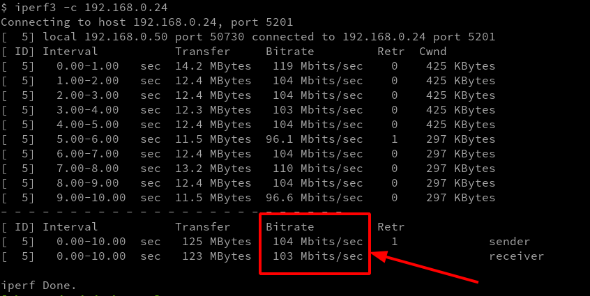

Testar a velocidade de conexão entre duas máquinas na mesma rede local. Uma será Windows e outra Linux. Mas poderiam ser ambas Windows ou Linux.

<!--more-->

Vamos utilizar o [iperf](https://github.com/esnet/iperf). Vamos usar o Windows 10 e o Fedora 33. O Windows vai agir como server e o Fedora como cliente, mas poderia ser o inverso.

## Instalando

- Para Windows, basta baixar o executável [aqui](https://iperf.fr/iperf-download.php) e descompactar em uma pasta.
- Para linux, em sistemas derivados do [RHEL](https://pt.wikipedia.org/wiki/Red_Hat_Enterprise_Linux), execute: `sudo dnf install iperf3`

## Server

No [PowerShell](https://docs.microsoft.com/pt-br/powershell/scripting/overview), onde você descompactou o `iperf`, execute:

```powershell
iperf3.exe -s
```

## Cliente / Testes

A forma mais básica de testar a velocidade:

```bash
iperf3 -c $IP_DO_SERVER
```

E você terá uma saída parecida com essa:



### Ouras opções

#### Testar usando `UDP`:

```bash
iperf3 -c $IP_DO_SERVER --udp
```

#### Testar especificando o tempo do teste em segundos:

```bash
iperf3 -c $IP_DO_SERVER --time 30
```

#### Testar especificando o tempo de cada parcial:

> 📋 Execute, compare e entenderá.

```bash
iperf3 -c $IP_DO_SERVER --time 30 --interval 5
```

#### Testar com N conexões em paralelo:

```bash
iperf3 -c $IP_DO_SERVER --time 30 --interval 5 --parallel 5
```

#### Testar no sentido contrário, do server para o cliente:

```bash
iperf3 -c $IP_DO_SERVER --time 30 --interval 5 --reverse
```
