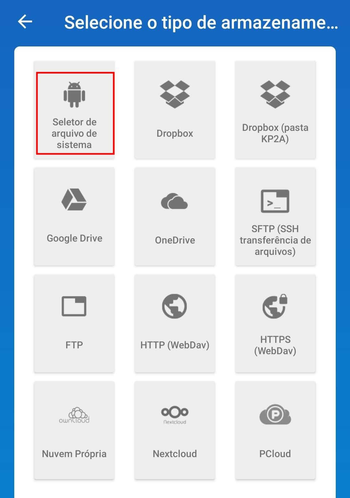

Como migrar do LastPass para o KeePass e manter os dados sincronizados entre os dispositivos no KeePass.

<!--more-->

O LastPass mantém as senhas na nuvem, enquanto o KeePass mantém as senhas em uma base de dados encriptada sobre o seu domínio, essa diferença motiva a mudança.

## Instalar o cliente do KeePass no Fedora Linux

```bash
sudo dnf install keepass keepassxc
```

- Versões para outros sistemas em <https://keepass.info/download.html>
- `keepass` e `keepassxc` fazem basicamente a mesma coisa, que é acessar e cadastrar senhas
- `keepass` tem uma interface mais simples, mas permite importar as senhas facilmente de diversos gerenciadores de senhas
- `keepassxc` tem uma interface mais moderna

## Exportar as senhas do LastPass

- No Chrome, clicar no ícone do LastPass, clicar em `Abrir meu cofre`
- menu `Opções avançadas` > `Exportar`
- selecione onde deseja salvar o arquivo `csv` gerado pelo LastPass

## Importar as senhas usando o `keepass`

### Criar a base de dados de senhas

- Abrir o KeePass
- menu `File` > `New`
- **Escolher o local da base dedados, ex: `$HOME/Database.kdbx`**
- **Definir a senha mestre (senha da base de dados de senhas)**
- Avançar
- Definir o nome da base de dados, ex: `MySecrets`
- Ok
- menu `File` > `Save`

> 📋 Guarde o arquivo `Database.kdbx` em um local seguro E **não esqueça a senha mestre**.

### Importar o `csv` gerado pelo LastPass

- no KeePass, menu `File` > `Import`
- selecionar `LastPass CSV` e apontar para o arquivo gerado pelo LastPass
- Clicar em Ok
- menu `File` > `Save`

## Acessar as senhas entre dispositivos

O LastPass facilita esse trabalho porque ele naturalmente sincroniza as senhas entre os diversos dispositivos: browser, android, iOS etc. Com o KeePass precisamos fazer isso manualmente.

É possível colocar o arquivo da base de dados no Dropbox, Google Drive etc, para que seja possível ter acesso às senhas no desktop, navegador, Android etc.

### Google Drive

Coloque o arquivo da base de dados de senhas em uma pasta do Google Drive, preferencialmente sincronizada com o seu desktop, para que você possa acessar as senhas pelo `keepass` e/ou `keepassxc`.

#### No Android

Usar o app [Keepass2Android Password Safe](https://play.google.com/store/apps/details?id=keepass2android.keepass2android) (citado no site do KeePass) e abrir o arquivo da base de dados de senhas pela opção `Seletor de arquivo de sistema`; no explorador de arquivos do Android, acessar o Google Drive e selecionar o arquivo da base de dados do KeePass. A sincronia será automática.



#### No Linux (Fedora)

Vamos usar o [GDrive](https://github.com/prasmussen/gdrive) (CLI não oficial do Google Drive) para sincronizar o arquivo da base de dados do KeePass.

```bash
# O link no repo está trocado, o 386 é de fato 64 bits (tem issue citando isso)
wget https://github.com/prasmussen/gdrive/releases/download/2.1.1/gdrive_2.1.1_linux_386.tar.gz
# descompactar

sudo alternatives \
  --install /usr/bin/gdrive gdrive ~/apps/gdrive/gdrive_2.1.1_linux_amd64/gdrive 200000

gdrive version

gdrive about
# aceitar o login com o Google, pegar o token e colar no console

# lista os arquivos do Google Drive
gdrive list

# obter o ID do arquivo da base dedados que você colocou no Google Drive
gdrive list --query "name = 'Database.kdbx'"
# vamos supor que seja o ID: 1EZgDETaZGRR5yqVcwF-jASpH-hhhRFPw

# download da base de dados de senhas (Database.kdbx)
gdrive download --path ~/Documents --force 1EZgDETaZGRR5yqVcwF-jASpH-hhhRFPw

# atualizar a base de dados de senhas no GoogleDrive
gdrive update 1EZgDETaZGRR5yqVcwF-jASpH-hhhRFPw ~/Documents/Database.kdbx
```

> 📋 Local onde o token utilizado pelo GDrive para acessar o Google Drive fica: `~/.gdrive/token_v2.json`.

#### Alias de download e upload da base de dados para o Google Drive

Adicionar ao final do seu `~/.bashrc` ou `~/.zshrc`.

```bash
# O ID do arquivo foi obtido com o comando: gdrive list --query "name = 'Database.kdbx'"
KEEPASS_DB_GOOGLE_DRIVE_FILE_ID=XXXXXXXXXX-ID-DO-ARQUIVO-AQUI-XXXXXXXXXX
KEEPASS_DB_LOCAL_PATH="$HOME/Documents/Database.kdbx"

check_keepass_db_diff() {
  HASH_REMOTE=`gdrive info $KEEPASS_DB_GOOGLE_DRIVE_FILE_ID | grep -P '^Md5sum: ' | awk -F ' ' '{ print $2 }'`
  HASH_LOCAL=`md5sum $KEEPASS_DB_LOCAL_PATH | awk '{ print $1 }'`
  echo "hash md5 remoto: $HASH_REMOTE"
  echo "hash md5 local : $HASH_LOCAL"
  echo "  hashs iguais : `if [ "$HASH_REMOTE" = "$HASH_LOCAL" ]; then echo 'iguais'; else echo 'diferentes'; fi`"
  [ "$HASH_REMOTE" != "$HASH_LOCAL" ]
}

# Download e Upload da minha base de dados de senhas do KeePass para o meu Google Drive
alias kp-download="if check_keepass_db_diff; then gdrive download --path ~/Documents --force $KEEPASS_DB_GOOGLE_DRIVE_FILE_ID; else echo 'Arquivos iguais, nao precisa de sincronizacao.'; fi"
alias kp-upload="if check_keepass_db_diff; then gdrive update $KEEPASS_DB_GOOGLE_DRIVE_FILE_ID $KEEPASS_DB_LOCAL_PATH; else echo 'Arquivos iguais, nao precisa de sincronizacao.'; fi"

# Fim: KeePass, sincronizacao com o Google Drive
```

### Dropbox

> 📋 Para Linux acaba sendo a melhor opção, já que não há um cliente oficial do Google Drive.

Aqui vamos iniciar pelo [Keepass2Android Password Safe](https://play.google.com/store/apps/details?id=keepass2android.keepass2android). Vá na opção `Dropbox (pasta KP2A)`, permita a conexão com o Dropbox - então, caso não exista, será criada a pasta `Apps / Keepass2Android` no seu Dropbox e o Keepass2Android terá acesso apenas a essa pasta.

Depois que a pasta for criada, coloque nela a base de dados do KeePass. Você pode fazer isso pelo Android, Web, Desktop etc.

Certamente você pode instalar o cliente do Dropbox para o desktop:

- Se Linux: <https://www.dropbox.com/install-linux>
- Outros: <https://www.dropbox.com/install>
