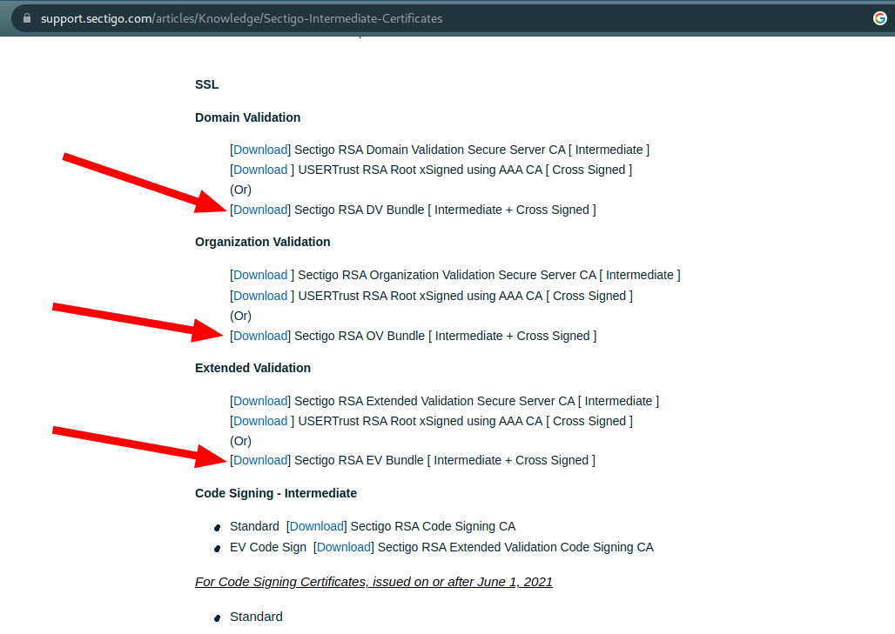

Esse certificado já é reconhecido pelo Chrome e Firefox. Mas em comandos como `curl` e `docker`, que olham para os certificados instalados no SO, pode ser que eles falhem ao acessar sites com https com certificado da Sectigo.

<!--more-->

### Ambiente

- Fedora 36

### Problema

Não é possível validar o certificado do site.

#### Exemplo com `curl`

```bash
$ curl https://git.mydomain.com:5050/v2/

curl: (60) SSL certificate problem: unable to get local issuer certificate
More details here: https://curl.se/docs/sslcerts.html
```

#### Exemplo com `docker`

```bash
$ docker login --username=myuser git.mydomain.com:5050

Password:
Error response from daemon: Get "https://git.mydomain.com:5050/v2/": x509: certificate signed by unknown authority
```

### Descobrindo a autoridade certificadora do site

```bash
$ echo | \
  openssl s_client -showcerts -servername gnupg.org -connect git.mydomain.com:5050 2>/dev/null | \
  openssl x509 -inform pem -noout -text | \
  grep -i -C 2 --color=always Issuer

Issuer: C = GB, ST = Greater Manchester, L = Salford, O = Sectigo Limited, CN = Sectigo RSA Organization Validation Secure Server CA
    CA Issuers - URI:http://crt.sectigo.com/SectigoRSAOrganizationValidationSecureServerCA.crt
```

Podemos observar no output que o certificado do site é emitido pela Sectigo.

### Verificando se a CA existe localmente (no SO)

```bash
trust list | grep -i -C 10 sectigo
```

Provavelmente não deve exibir nada ou, se exibir, não é a CA necessária.

### Instalar o certificado da CA

#### Baixar

Acessar o site oficial da Sectigo [clicando aqui](https://support.sectigo.com/articles/Knowledge/Sectigo-Intermediate-Certificates) e baixar os três certificados mostrados na imagem abaixo.



Que devem ser os arquivos:

- SectigoRSADVBundle.pem
- SectigoRSAOVBundle.pem
- SectigoRSAEVBundle.pem

#### Copiar para `/etc/pki/ca-trust/source/anchors/`

```bash
sudo cp ~/SectigoRSA*.pem /etc/pki/ca-trust/source/anchors/

## checando
ls -la /etc/pki/ca-trust/source/anchors/
```

#### Atualizar os certificados do SO

```bash
sudo update-ca-trust
```

#### Verificar que agora o SO reconhece a CA

```bash
$ trust list | grep -i -C 10 sectigo

pkcs11:id=%8D%8C%5E%C4%54%AD%8A%E1%77%E9%9B%F9%9B%05%E1%B8%01%8D%61%E1;type=cert
    type: certificate
    label: Sectigo RSA Domain Validation Secure Server CA
    trust: anchor
    category: authority
--
pkcs11:id=%2C%69%FF%80%C9%87%90%AE%34%E1%B4%E7%4C%93%85%99%40%E9%A7%B2;type=cert
    type: certificate
    label: Sectigo RSA Extended Validation Secure Server CA
    trust: anchor
    category: authority
--
pkcs11:id=%17%D9%D6%25%27%67%F9%31%C2%49%43%D9%30%36%44%8C%6C%A9%4F%EB;type=cert
    type: certificate
    label: Sectigo RSA Organization Validation Secure Server CA
    trust: anchor
    category: authority
```

### Hora do teste!

#### Com o `curl`

```bash
$ curl https://git.mydomain.com:5050/v2/

{"errors":[{"code":"UNAUTHORIZED","message":"authentication required","detail":null}]}
```

🎉 🎉 🎉 Agora sem erros de SSL. O erro mostrado acima já é a aplicação requerendo autenticação. Sucesso então!

#### Com o `docker`

> Como as CAs foram atualizadas no SO, é necessário antes reiniciar o docker: `sudo systemctl restart docker`

```bash
$ docker login --username=devops.rav git.mydomain.com:5050

Password:
WARNING! Your password will be stored unencrypted in /home/mhagnumdw/.docker/config.json.
Configure a credential helper to remove this warning. See
https://docs.docker.com/engine/reference/commandline/login/#credentials-store

Login Succeeded
```

🎉 🎉 🎉 Sucesso!

### Referências

- <https://serverfault.com/questions/661978/displaying-a-remote-ssl-certificate-details-using-cli-tools>
- <https://docs.fedoraproject.org/en-US/quick-docs/using-shared-system-certificates>
- <https://support.sectigo.com/articles/Knowledge/Sectigo-Intermediate-Certificates>
