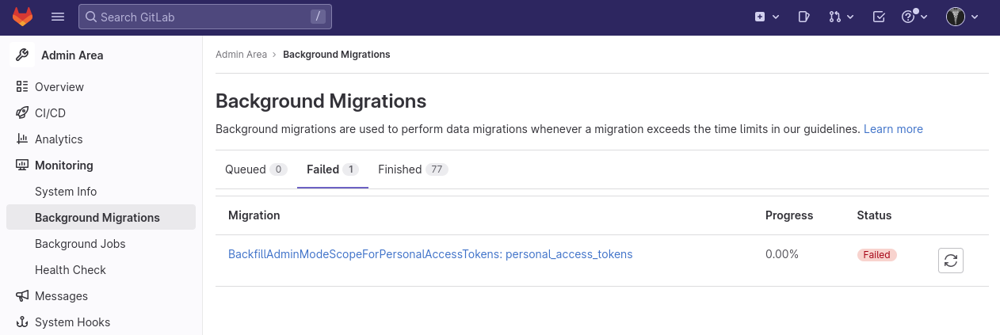
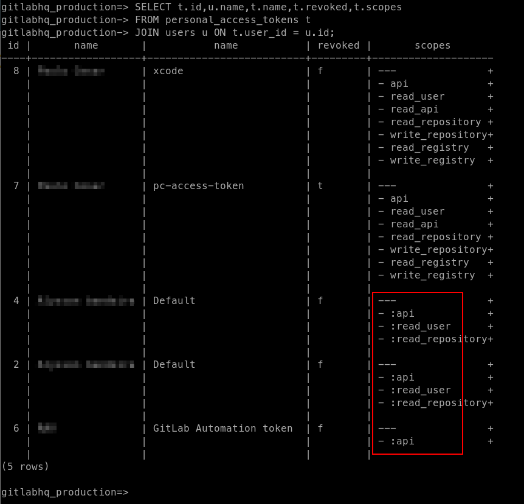
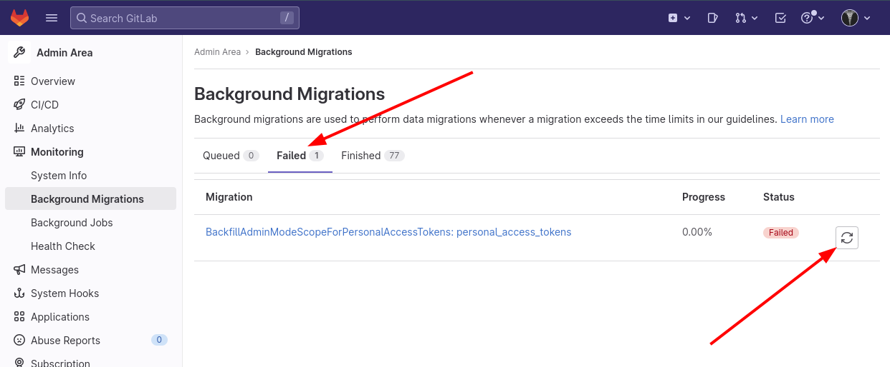

Problem with the background migration `BackfillAdminModeScopeForPersonalAccessTokens: personal_access_tokens`  that fails after updating GitLab from version 15.4.6 to 15.8.1.

<!--more-->

> At the moment, Google doesn't return anything for `"BackfillAdminModeScopeForPersonalAccessTokens"`, but searching directly on GitLab.com I found an [issue](https://gitlab.com/gitlab-org/gitlab/-/issues/388935). Interestingly, [bing.com](https://www.bing.com/search?q=%22BackfillAdminModeScopeForPersonalAccessTokens%22) and [duckduckgo.com](https://duckduckgo.com/?q=%22BackfillAdminModeScopeForPersonalAccessTokens%22) find it.

## Problem



## Cause of the problem

On the GitLab machine, in the command line, go to the GitLab DB prompt

```bash
gitlab-rails db
```

And execute

```sql
SELECT t.id,u.name,t.name,t.revoked,t.scopes
FROM personal_access_tokens t
JOIN users u ON t.user_id = u.id;
```

The problem is the scopes starting with `:`



## Solutions

### Remove the `:` from the scopes

I prefer this. Remove the `:` from the scopes (replace only removes the first occurrence of the string, great!)

```sql
UPDATE personal_access_tokens
SET scopes = replace(scopes, ':', '');
```

Or you can revoke the tokens, as below.

### Revoke the tokens

Revoke the tokens that have `:` in the scope, something like

```sql
UPDATE personal_access_tokens
SET revoked = 't'
WHERE id in (4, 2 ,6);
```

## Manually run the background migration



Which should run successfully 🎉🎉🎉

## References

- <https://gitlab.com/gitlab-org/gitlab/-/issues/388935>
