Configurar o Postman para realizar requests para um API que precisa de autenticação no Keycloak. Será utilizado o padrão de mercado OpenID Connect com OAuth2. O fluxo do OAuth2 será o Authorization Code + PKCE.

<!--more-->

Índice

- [Criar uma coleção](#criar-uma-coleção)
- [Configurar a autorização na coleção](#configurar-a-autorização-na-coleção)
  - [Definir algumas variáveis](#definir-algumas-variáveis)
  - [Selecionar OAuth 2.0](#selecionar-oauth-20)
  - [Confirmar o WARN se estiver de acordo](#confirmar-o-warn-se-estiver-de-acordo)
  - [Configurar um novo token](#configurar-um-novo-token)
  - [Gerar um novo token para um dado usuário](#gerar-um-novo-token-para-um-dado-usuário)
  - [Gerar um novo token para outro usuário](#gerar-um-novo-token-para-outro-usuário)
- [Realizar uma requisição HTTP com o Access Token](#realizar-uma-requisição-http-com-o-access-token)
- [Alternar entre usuários](#alternar-entre-usuários)

## Criar uma coleção

Você pode usar uma coelação já existente, mas se não sabe bem o que está fazendo, crie uma nova.

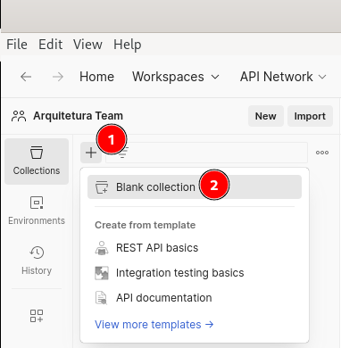

Nomear a coleção:

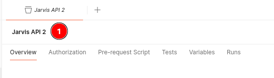

## Configurar a autorização na coleção

A vantagem de configurar a autorização na coleção e não diretamente em um request, é que fica possível e super fácil reusar a configuração de autenticação entre todos os requests da coleção.

### Definir algumas variáveis

1. ID do cliente OAuth2 (se não souber, obtenha com o seu provedor de autenticação)
	- Será utilizado pelo Postman para obter o token
2. O endereço base para o endpoint da API
	- Será utilizado para fazer os requests para a API

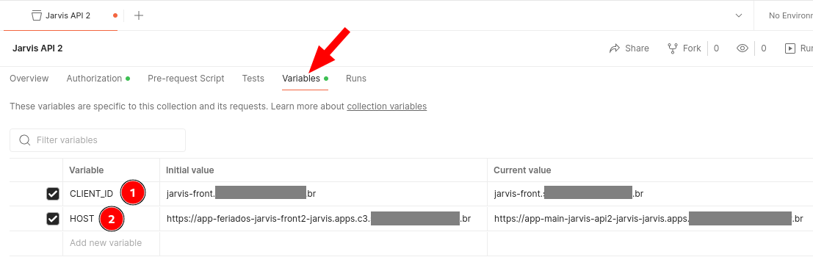

### Selecionar OAuth 2.0

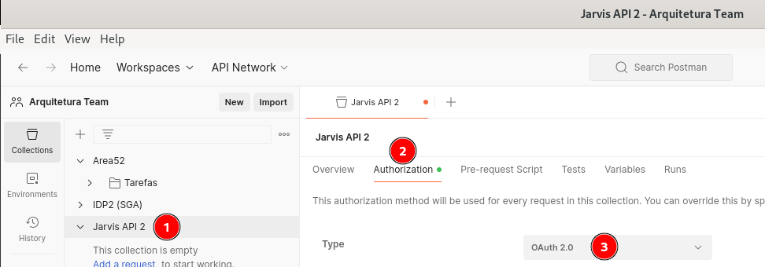

### Confirmar o WARN se estiver de acordo

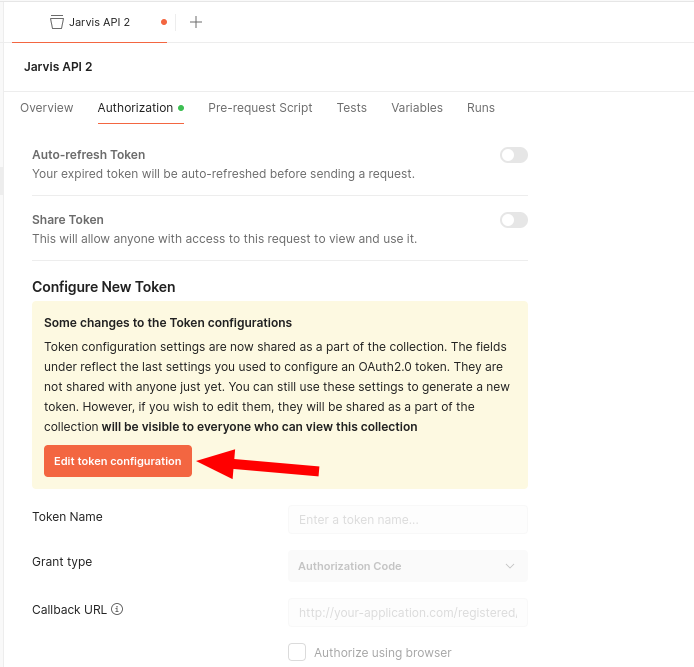

### Configurar um novo token

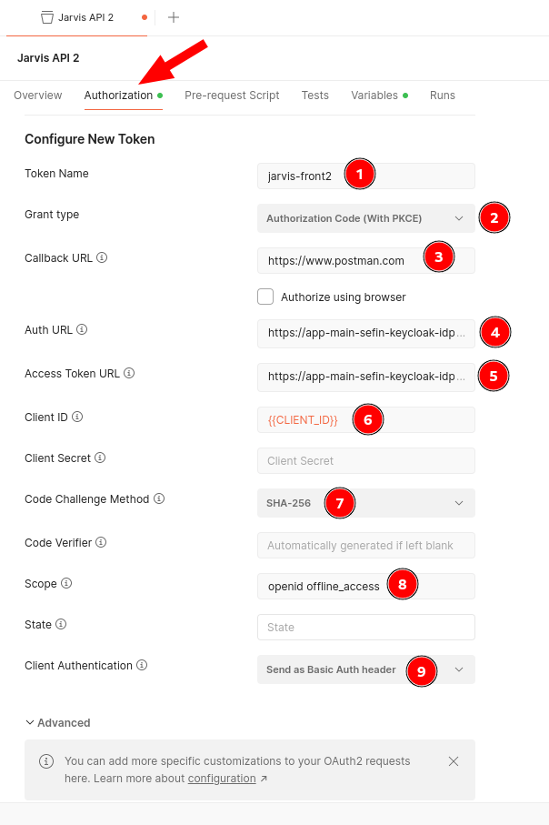

Sobre alguns itens:

- 1. Um nome arbitrário (foi usado o nome da aplicação)
- 3. Em `Callback URL` usar o valor <https://www.postman.com>
- 4. Em `Auth URL` usar <https://app-main-sefin-keycloak-idp2.app.dev.xxxxxxxxxx.br/realms/jarvis/protocol/openid-connect/auth> (ajuste conforme seu caso)
- 5. Em `Access Token URL` usar <https://app-main-sefin-keycloak-idp2.app.dev.xxxxxxxxxx.br/realms/jarvis/protocol/openid-connect/token> (ajuste conforme seu caso)
- 8. Em `Scope` usar `openid offline_access`

### Gerar um novo token para um dado usuário

Ao final, ainda na aba `Authorization`, clicar em ambos os botões:

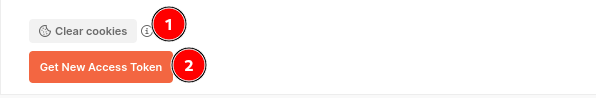

Então deve abrir uma modal...

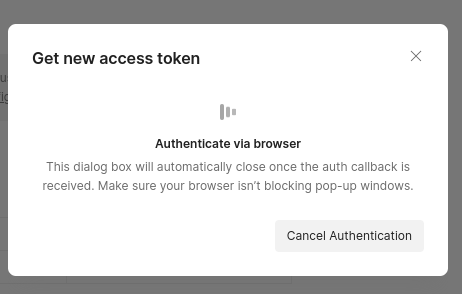

...e também a janela de autenticação do Keycloak, solicitando usuário e senha:

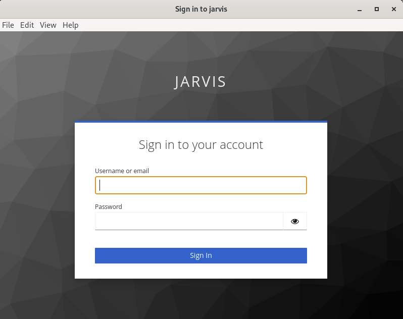

Basta colocar as credenciais e se autenticar. Após, deve aparecer o modal abaixo ...

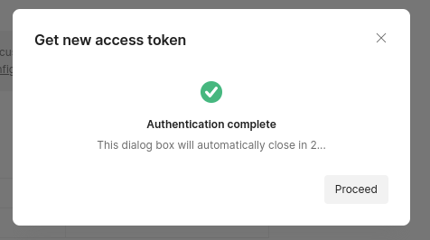

... e logo em seguida os dados do token:

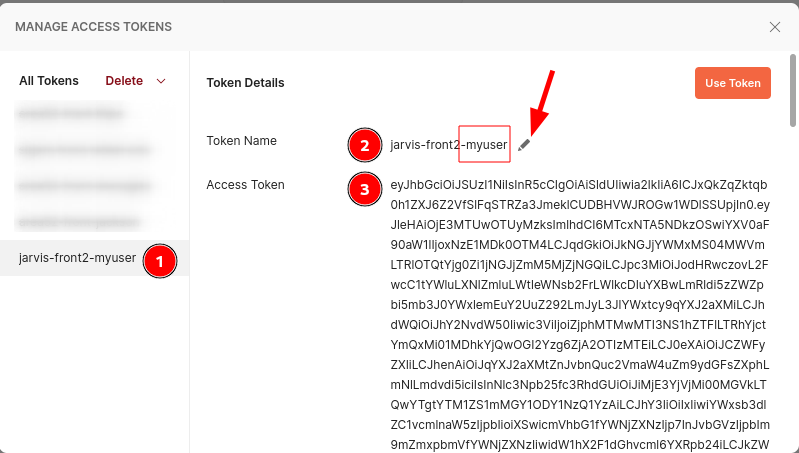

Usando a edição apontada pela seta vermelha, **eu adicionei, ao final do nome do token, o nome do usuário para qual o token foi gerado. Isso ajuda a identificar de quem é o token,** pois você pode ter tokens para usuários diferentes durantes suas requisições.

Clicar em `Use Token`:

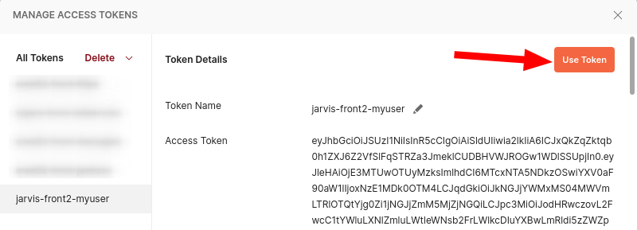

Então a área `Current Token` é preenhida automaticamente:

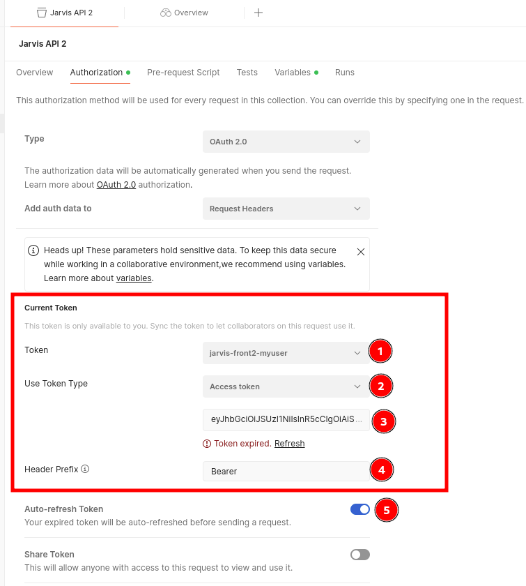

Observar:
- no item 1 o nome do token, que acaba identificando o usuário
- o token está no item 3
- o auto-refresh do token foi marcado no item 5
- é possível forçar um refresh manual no link `Refresh` (entre o item 3 e 4)

### Gerar um novo token para outro usuário

Basta seguir basicamente o que já foi feito. Clicar em `Clear cookies` e em seguida em `Get New Access Token`:

Se logar na tela do Keycloak que vai abrir. E após logar definir o nome do token e decidir se deseja usá-lo ou não:

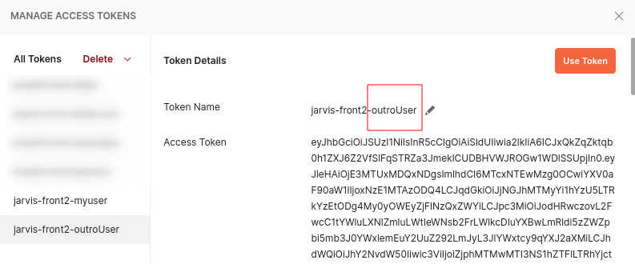

## Realizar uma requisição HTTP com o Access Token

Basta criar uma requisição, na guia `Auth` selecionar o `Inherit auth from parent` e realizar a requisição

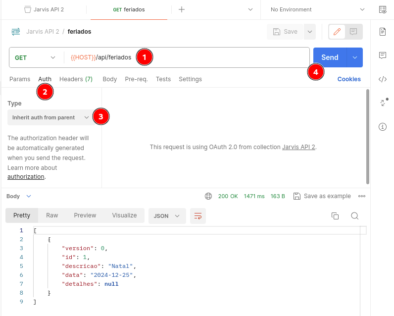

A requisição deu sucesso e é possível ver que o token foi enviado no request

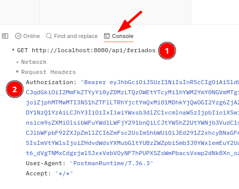

## Alternar entre usuários

Na configuração da coleção, na aba `Authorization`, mudar de usuário conforme a imagem:

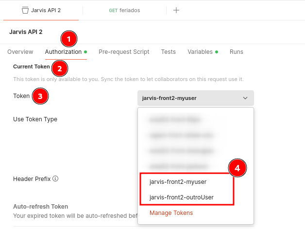
