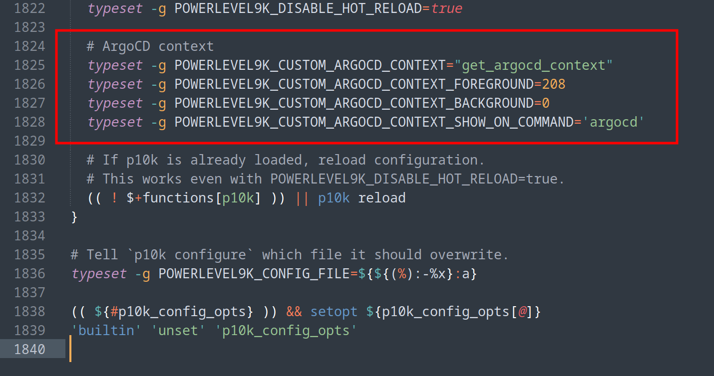
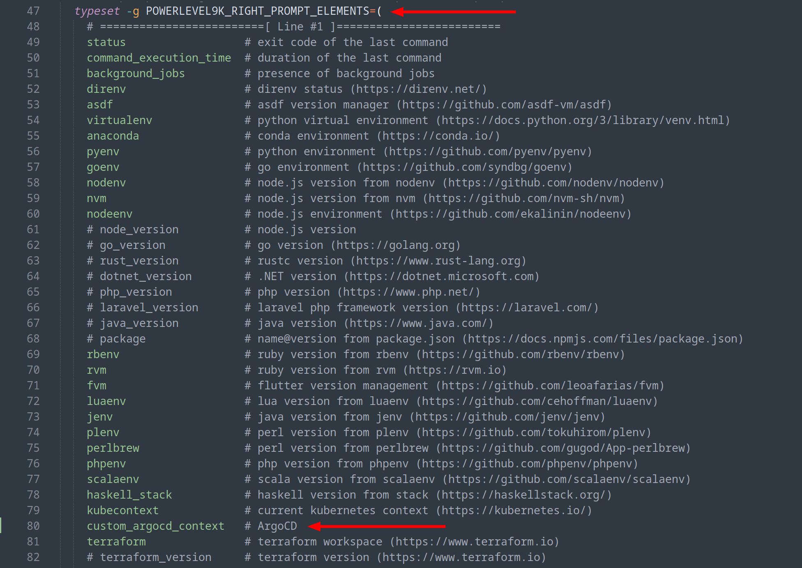
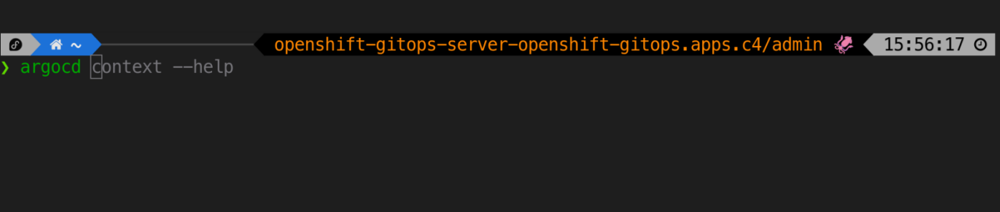

Configurar para que o contexto corrente do ArgoCD apareça no prompt (PS1), conforme a imagem de capa desse post. Usando o powerlevel10k.

<!--more-->

> Isso é bastante útil quando estamos trabalhando em vários clusters.

## Premissas

- ter o [powerlevel10k](https://github.com/romkatv/powerlevel10k) instalado
- ter instalado os utilitários de linha de comando `jq` (para json) e `yq` (para yaml)

## Arquivo `~/.p10k.zsh`

### Definir `POWERLEVEL9K_CUSTOM_ARGOCD_CONTEXT*`

No arquivo `~/.p10k.zsh`, navegar até o final, e antes da última chave `}`, adicionar:

```bash
  # ArgoCD context
  typeset -g POWERLEVEL9K_CUSTOM_ARGOCD_CONTEXT="get_argocd_context"
  typeset -g POWERLEVEL9K_CUSTOM_ARGOCD_CONTEXT_FOREGROUND=208
  typeset -g POWERLEVEL9K_CUSTOM_ARGOCD_CONTEXT_BACKGROUND=0
  typeset -g POWERLEVEL9K_CUSTOM_ARGOCD_CONTEXT_SHOW_ON_COMMAND='argocd'
```

Conforme a imagem abaixo:



### Atualizar `POWERLEVEL9K_RIGHT_PROMPT_ELEMENTS`

Navegar até a linha contendo `typeset -g POWERLEVEL9K_RIGHT_PROMPT_ELEMENTS=(` e abaixo de `kubecontext` adicionar:

```bash
custom_argocd_context   # ArgoCD
```

Conforme a imagem abaixo:



## Arquivo `~/.zshrc`

Adicionar a função abaixo no início do `~/.zshrc`.

> Essa função apenas vai ler o arquivo `~/.config/argocd/config`, que é onde o ArgoCD CLI guarda as informações dos contextos que ele conhece, e extrair as informações do contexto corrente.

```bash
get_argocd_context() {
  if ! command -v jq &>/dev/null || ! command -v yq &>/dev/null; then
    echo "argocd: sem jq ou yq 🦑"
    return
  fi
  local config_file="$HOME/.config/argocd/config"
  if [[ -f "$config_file" ]]; then
    local context
    context=$(grep 'current-context:' "$config_file" | awk '{print $2}')
    if [[ -n "$context" ]]; then
      local auth_token_jwt
      auth_token_jwt=$(yq eval ".users[] | select(.name == \"$context\") | .auth-token" "$config_file")

      local user
      user=$(echo "$auth_token_jwt" | cut -d '.' -f2 | base64 --decode | jq -r '.sub')
      user=$(echo "$user" | awk -F ':' '{print $1}')

      # aqui você pode fazer uma personalização qualquer no seu `context`,
      # nesse exemplo removendo o domínio apenas para ficar menor
      context=${context//.meudominio.com.br/}

      echo "${context}/${user} 🦑"
      return
    fi
  fi
  echo "no argocd context 🦑"
}
```

Agora recarregue o seu shell ou o terminal.

## Resultado

Ao digitar `argocd` vai aparecer o contexto no prompt, conforme image abaixo:



## Melhorias

Conforme o post [powerlevel10k/issues/2762](https://github.com/romkatv/powerlevel10k/issues/2762#issuecomment-2368965278), o p10k (powerlevel10k) já fornece um meio para implementar prompts customizados, para isso ver a documentação: `p10k help segment`. Com isso talvez possamos melhorar algo!
