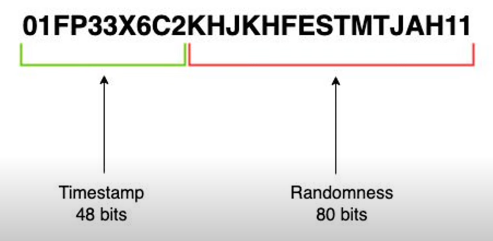
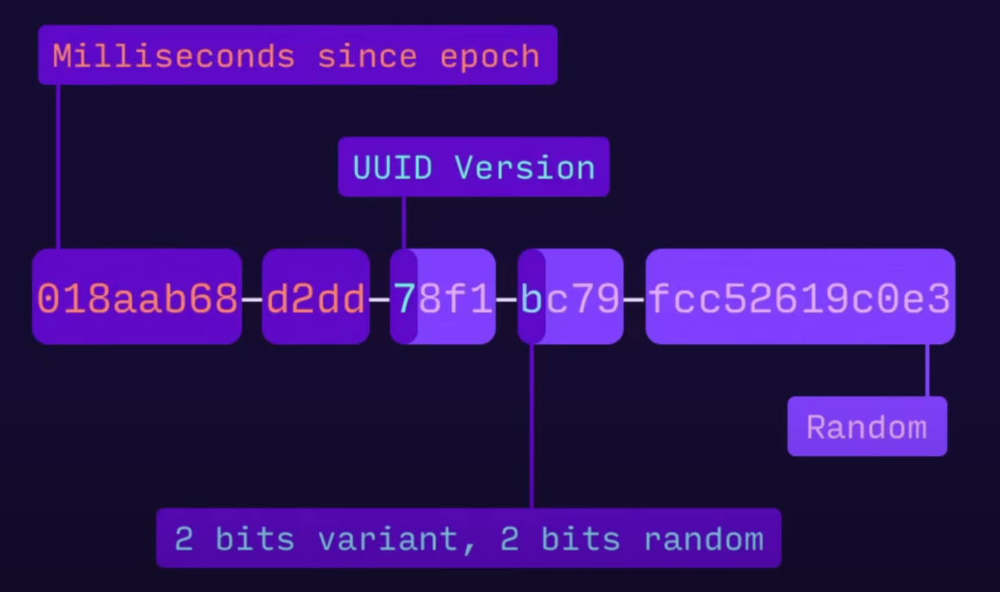
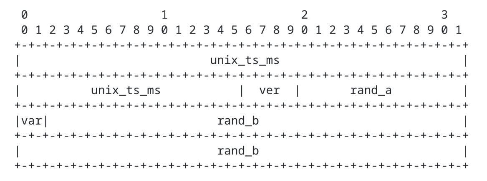
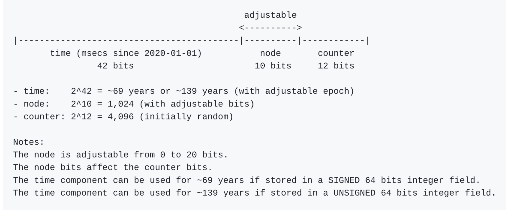
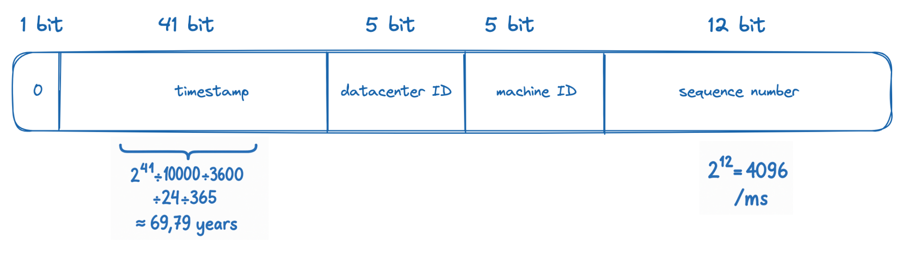

Um resumo sobre alguns tipos de IDs, principalmente os que podem ser expostos de forma segura, sem previsibilidade e preferencialmente que suportem ordenação.

<!--more-->

Os principais que serão abordados aqui são: ULID, UUIDv7 e TSID.



- [Características principais](#características-principais)
- [ULID](#ulid)
  - [Características](#características)
  - [Anatomia](#anatomia)
  - [Links](#links)
- [UUIDv7](#uuidv7)
  - [Características](#características-1)
  - [Anatomia](#anatomia-1)
  - [Links](#links-1)
- [UUID de forma geral](#uuid-de-forma-geral)
  - [Características](#características-2)
  - [Links](#links-2)
  - [Recomendações](#recomendações)
- [TSID](#tsid)
  - [Características](#características-3)
  - [Anatomia](#anatomia-2)
  - [Links](#links-3)
- [Snowflake do Twitter/X](#snowflake-do-twitterx)
- [KSUID](#ksuid)
- [NanoID](#nanoid)
  - [Características](#características-4)
  - [Links](#links-4)
- [Tabela comparativa 📊](#tabela-comparativa-)
- [Consultas / SQL](#consultas--sql)
- [Projeto de POC com IDs](#projeto-de-poc-com-ids)
- [Referências](#referências)



## Características principais

- **Previsibilidade ou não:** se é possível facilmente "chutar" e acertar um outro ID
- **Ordenável ou não:** ordenável é bom para índices que utilizam árvores balanceadas
- **Armazenamento:** como binário ou texto ou número e o tamanho de cada

## ULID

### Características

- Tamanho: 128 bits
- Ordenável pelo timestamp de geração
- Ordenável lexicograficamente ("alfabeticamente")
- Pode ser armazenado como UUID/GUID por bancos que suportam
- Pode ser armazenado como uma string de 26 caracteres codificada em [Base32 Crockford](https://www.crockford.com/base32.html)
- Pode ser armazenado como um array de 16 bytes  (binário)
- URL-safe, não diferencia maiúsculas de minúsculas e não possui hifens

### Anatomia



128 bits ao todo. Divididos em:

**Timestamp**

- 48 bits
- Total de milissegundos desde Unix time, ou seja, desde  01/01/1970 em UTC
- Consegue contar até até o ano de 10889 d.C.

**Aleatório**

- 80 bits aleatórios

### Links

- Especificação: <https://github.com/ulid/spec>
- Implementação Java: <https://github.com/f4b6a3/ulid-creator>

> Depoimentos na internet
>
> - Aqui no C6 adotamos o ULID, que já resolve o problema do rebalancameanto da btree, já que ele é ordenavel. Além de permitir busca por períodos de data usando a PK, já que ele usa timestamp como parte do identificador

## UUIDv7

### Características

- Tamanho: 128 bits
- Ordenável pelo timestamp de geração
- Ordenável lexicograficamente ("alfabeticamente")
- Pode ser armazenado como UUID/GUID por bancos que suportam (ideal)
- Pode ser armazenado como uma string de 36 caracteres (288 bits = 36 bytes)
- Pode ser armazenado como um array de 16 bytes (binário)
- URL-safe

### Anatomia



- 128 bits ao todo.
- O timestamp é o total de milissegundos desde Unix time, ou seja, desde  01/01/1970 em UTC
- O 13º caractere indica o tipo de UUID, no caso 7

Anatomia binária:



### Links

- Especificação: <https://datatracker.ietf.org/doc/html/rfc9562#name-uuid-version-7>
- Implementação Java: <https://github.com/f4b6a3/uuid-creator>

> Depoimentos na internet
>
> - Atualmente estou trabalhando em um SaaS multi tenant com milhares de dados e os benchmakrs de escrita diferem bastante quando movemos de uuid v4 para v7

## UUID de forma geral

### Características

- Tamanho: 128 bits
- Pode ser criado na camada da aplicação
- O 13º caractere indica a versão do UUID (atualmente são 8 versões)
- Pode ser armazenado como UUID/GUID por bancos que suportam (ideal)
- Pode ser armazenado como uma string de 36 caracteres (288 bits = 36 bytes)
- Pode ser armazenado como um array de 16 bytes (binário)
- Especificação: <https://datatracker.ietf.org/doc/html/rfc9562>

### Links

- UUIDv1 (Time-Based): <https://datatracker.ietf.org/doc/html/rfc9562#name-uuid-version-1>
- UUIDv2 (DCE Security): <https://datatracker.ietf.org/doc/html/rfc9562#name-uuid-version-2>
- UUIDv3 (MD5 Hash-Based): <https://datatracker.ietf.org/doc/html/rfc9562#name-uuid-version-3>
- UUIDv4 (Random): <https://datatracker.ietf.org/doc/html/rfc9562#name-uuid-version-4>
- UUIDv5 (SHA-1 Hash-Based): <https://datatracker.ietf.org/doc/html/rfc9562#name-uuid-version-5>
- UUIDv6 (Reordered Time-Based): <https://datatracker.ietf.org/doc/html/rfc9562#name-uuid-version-6>
- UUIDv7 (Time-Ordered Epoch): <https://datatracker.ietf.org/doc/html/rfc9562#name-uuid-version-7>
- UUIDv8 (Custom): <https://datatracker.ietf.org/doc/html/rfc9562#name-uuid-version-8>

> Depoimentos na internet
>
> - Uma desvantagem: UUID sendo maior, vc gasta mais storage, o q nao eh mt relevante, mas o seus indexes ficam maiores (pq em geral vc vai ter index em ids), e ae vao caber menos no cache de memoria, e isso pode sim ter um impacto relevante em performance (pq memoria nao eh tao barato assim)

### Recomendações

Para novos projetos

- 🏆 UUIDv7 (if you need time ordering + security)
- 🎯 UUIDv4 (if pure randomness suffices)

Guia de migração

- 🔄 v1 → v6/v7 (better privacy/ordering)
- ⚠️ v3/v5 → v7 + external hashing (security upgrade)

## TSID

### Características

- Tamanho: 64 bits
- Ordenável pelo timestamp de geração
- Ordenável lexicograficamente ("alfabeticamente")
- Pode ser armazenado como um inteiro de 64 bits
- Pode ser armazenado como uma string de 13 caracteres codificada em [Base32 Crockford](https://www.crockford.com/base32.html)
- URL-safe, não diferencia maiúsculas de minúsculas e não possui hifens
- Menor que UUID, ULID e KSUID

### Anatomia



- Timestamp de 42 bits ao nível de milissegundos
- Node + counter sempre tem que somar 22 bits
- Ajustar o tamanho do node ajusta automaticamente o tamanho do counter
- O node pode ser definido para 0 bits, o que deixa o counter com 22 bits
- O contador é incrementado a cada chamada dentro do mesmo milissegundo e ao mudar de milissegundo o contador é definido para um valor aleatório a partir do qual é reiniciada a contagem

### Links

- <https://github.com/f4b6a3/tsid-creator>
- <https://github.com/vladmihalcea/hypersistence-tsid?tab=readme-ov-file>

## Snowflake do Twitter/X

- 64 bits = 8 bytes



## KSUID

- Tamanho: 20 bytes
- Especificação: <https://github.com/segmentio/ksuid>
- Implementação Java: <https://github.com/f4b6a3/ksuid-creator>

## NanoID

### Características

- Sem ordenação
- Permite personalizar o tamanho do ID

### Links

- Especificação: <https://github.com/ai/nanoid?tab=readme-ov-file>
- Nano ID Collision Calculator: <https://zelark.github.io/nano-id-cc/>

> Depoimentos na internet
>
> - Uso sempre o nanoid com 21 char, na minha opinião é o melhor dos mundos, a colisão aconteceria em ~41 milhões de anos com a inserção de 1.000 ids por segundo.

## Tabela comparativa 📊

| Implementation | Sortable | Security | Storage            | Oracle Type                   | Collision Risk | RFC Status                                                                 |
|----------------|----------|----------|--------------------|-------------------------------|----------------|----------------------------------------------------------------------------|
| ULID           | ✅       | ✅       | 128b / 26char      | `RAW(16)` / `CHAR(26)`        |                | [Spec](https://github.com/ulid/spec)                                       |
| UUIDv7         | ✅       | ✅       | 128b / 36char      | `RAW(16)` / `VARCHAR2(36)`    |                | [RFC 9562](https://datatracker.ietf.org/doc/html/rfc9562#name-uuid-version-7) |
| TSID           | ✅       | ✅       | 64b (int) / 20char | `NUMBER(20)` / `VARCHAR2(20)` |                | [Lib](https://github.com/f4b6a3/tsid-creator)                              |
||
| UUIDv1         | ✅       | ❌       | 128b / 36char      | `RAW(16)` / `VARCHAR2(36)`    |                | [RFC 9562](https://datatracker.ietf.org/doc/html/rfc9562#name-uuid-version-1) |
| UUIDv2         | ⚠️       | ❌       | 128b / 36char      | `RAW(16)` / `VARCHAR2(36)`    |                | [RFC 9562](https://datatracker.ietf.org/doc/html/rfc9562#name-uuid-version-2) |
| UUIDv3         | ❌       | ❌       | 128b / 36char      | `RAW(16)` / `VARCHAR2(36)`    |                | [RFC 9562](https://datatracker.ietf.org/doc/html/rfc9562#name-uuid-version-3) |
| UUIDv4         | ❌       | ✅       | 128b / 36char      | `RAW(16)` / `VARCHAR2(36)`    |                | [RFC 9562](https://datatracker.ietf.org/doc/html/rfc9562#name-uuid-version-4) |
| UUIDv5         | ❌       | ⚠️       | 128b / 36char      | `RAW(16)` / `VARCHAR2(36)`    |                | [RFC 9562](https://datatracker.ietf.org/doc/html/rfc9562#name-uuid-version-5) |
| UUIDv6         | ✅       | ❌       | 128b / 36char      | `RAW(16)` / `VARCHAR2(36)`    |                | [RFC 9562](https://datatracker.ietf.org/doc/html/rfc9562#name-uuid-version-6) |
| UUIDv8         | ❌       | ❌       | 128b / 36char      | `RAW(16)` / `VARCHAR2(36)`    | User-defined   | [RFC 9562](https://datatracker.ietf.org/doc/html/rfc9562#name-uuid-version-8) |
| NanoID         | ❌       | ✅       | 64b / 21char       | `RAW(8)` / `VARCHAR2(21)`     |                | [Lib](https://github.com/ai/nanoid)                                        |
| KSUID          | ✅       | ✅       | 160b / 27char      | `RAW(20)` / `VARCHAR2(27)`    |                | [Spec](https://github.com/segmentio/ksuid)                                 |

Legenda:

- Sortable: Capacidade de ordenação temporal nativa
- Security: Resistência a previsibilidade/ataques
- Storage:  
  - Binário (ex: `128b` = 16 bytes)
  - Texto (ex: `26char` = 26 caracteres)
  - Numérico (ex: `64b (int)` = inteiro correspondente a 2^64)
- Oracle Type: Tipo de dado no Oracle
- Collision Risk: Probabilidade aproximada de colisão por unidade temporal
- RFC Status:
  - `RFC`: Padrão formal
  - `Spec`: Especificação pública não-RFC
  - `Lib`: Definido por biblioteca

## Consultas / SQL

Algumas dicas de SQL que podem ser úteis.

Verificar no Oracle 19c o tamanho, em bytes, do valor ocupado por uma coluna (não o tamanho declarado pelo tipo da coluna):

```sql
SELECT
    ID_CIDADE, VSIZE(ID_CIDADE) AS TAMANHO_BYTES,
    NOME, VSIZE(NOME) AS NOME_TAMANHO_BYTES
FROM CIDADE
ORDER BY ID_CIDADE desc;
```

Função `to_uuid` para exibir o UUID textualmente no Oracle:

```sql
CREATE OR REPLACE
FUNCTION to_uuid(p_raw RAW)
RETURN VARCHAR2
IS
BEGIN
  RETURN LOWER(
    REGEXP_REPLACE(
      RAWTOHEX(p_raw),
      '(.{8})(.{4})(.{4})(.{4})(.{12})',
      '\1-\2-\3-\4-\5'
    )
  );
END;
/
```

## Projeto de POC com IDs

[POC with UUIDv4, UUIDv7, ULID, TSID etc, with Quarkus, Hibernate and Rest](https://github.com/mhagnumdw/ids-poc)

## Referências

- Internet
- <https://www.youtube.com/watch?v=o5WFZiLVF3Y>
- <https://www.youtube.com/watch?v=5oBU5z9E25E>
- <https://www.youtube.com/watch?v=gD_jNycKo-c>
- <https://www.youtube.com/watch?v=wkqwyrcuPs0>
- <https://www.youtube.com/watch?v=a-K2C3sf1_Q>
- <https://planetscale.com/blog/the-problem-with-using-a-uuid-primary-key-in-mysql>
- <https://github.com/vladmihalcea/hypersistence-tsid?tab=readme-ov-file>
- <https://vladmihalcea.com/uuid-database-primary-key>
- <https://www.linkedin.com/pulse/primary-keys-db-what-use-id-vs-uuid-something-else-lucas-persson/>
